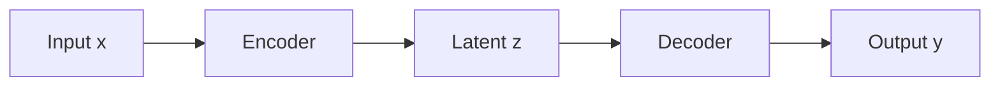

<!--
  AUTHORING CHEAT-SHEET (delete this comment block in real posts)

  MATH (LaTeX via MathJax):
    • Write ALL math with $$ ... $$ — works both inline and as a display block.
      Inline:  the loss $$\mathcal{L}(\theta)$$ is minimised   <- stays in the text line
      Display: put $$ ... $$ in its own paragraph (blank line above and below).
    • Inside $$ ... $$ kramdown does NOT run Markdown on the content, so write NORMAL
      LaTeX: single backslashes, plain \\ for row breaks, _ subscripts, * etc. all safe.
    • Do NOT use single $...$ (collides with prices / shell $VARs) and do NOT use the
      old \[ ... \] / \( ... \) double-backslash hack — $$ is cleaner and more robust.
    • Bare \begin{align}...\end{align} also works (processEnvironments is on), but
      wrapping it in $$ ... $$ is the safest and most consistent.

  DIAGRAMS (Mermaid): just write a ```mermaid fenced code block (see example below).

  IMAGES: use a <figure> (gets centering, a caption, and lazy-loading automatically).
-->

## 1. Inline and display math

The attention weights are a softmax over scaled dot products, $$\alpha_{ij}$$, so each
token attends to every other token. The full operation is:

$$
\mathrm{Attention}(Q, K, V) = \mathrm{softmax}\!\left( \frac{Q K^{\top}}{\sqrt{d_k}} \right) V
$$

## 2. A multi-line environment (note the plain `\\` row breaks)

$$
\begin{aligned}
\mathbf{z} &= W\mathbf{x} + \mathbf{b} \\
\hat{\mathbf{y}} &= \sigma(\mathbf{z})
\end{aligned}
$$

A matrix works the same way:

$$
A = \begin{pmatrix} a & b \\ c & d \end{pmatrix}
$$

## 3. A Mermaid diagram



## 4. A figure (centered, captioned, lazy-loaded)

<figure style="width: 70%; margin: 1.5em auto;">
  
  <figcaption>Figure 1. A descriptive caption.</figcaption>
</figure>

## 5. A table

| Model        | Metric A | Metric B |
|--------------|:--------:|:--------:|
| Baseline     |   24.6   |   39.0   |
| **Ours**     | **28.4** | **41.8** |
