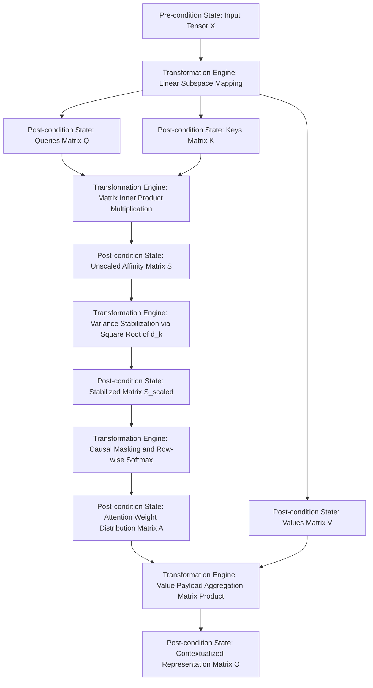
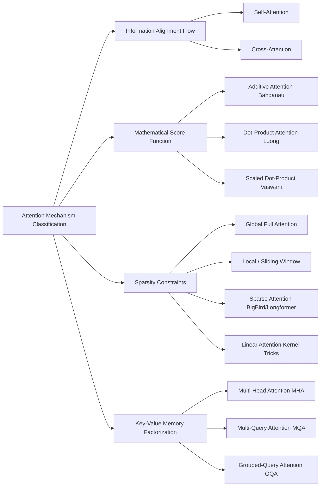

Traditional architectures like RNNs or LSTMs suffer from the information bottleneck syndrome. These models process data sequentially, so they are forced to compress an entire historical sequence of arbitrary length into a single, fixed-size hidden state vector $h_{t}$. This introduces long-range dependency degradation: as the distance between interacting tokens increases, early context is systematically erased or overwritten by incoming tokens due to continuous numerical overwriting within the recurrent state.

An attention mechanism eliminates this sequential compression. Instead of relying on a static historical vector, attention allows an active token representation to query the entire sequence history simultaneously. This grants the model direct, mathematically uninhibited access to any past state regardless of its temporal or spatial distance.

- **Token:** Discrete atomic unit of sequence data (e.g., a word or sub-word piece) mapped to an integer index.
- **Embedding matrix:** Static parameter tensor that maps a discrete token index to a continuous, high-dimensional vector space.
- **Context window ($T$):** Maximum sequence length boundary that the attention layer can physically map and compute simultaneously.
- **Query vector ($\mathbf{q}$):** Representation of the current token looking out across the sequence to find relevant context.
- **Key vector ($\mathbf{k}$):** Index pointer or attribute profile representing every token in the sequence, matched against incoming queries.
- **Value vector ($\mathbf{v}$):** Actual semantic payload or content stored within a token, aggregated into the final representation if its corresponding key matches the query.

## History

The shift toward attention mechanisms was driven by a clear mathematical limitation: the vanishing gradient wall along the temporal axis. In recurrent networks, backpropagating an error signal from step $T$ to step $1$ requires repeatedly multiplying by the recurrent weight matrix $W_{hh}$ at every intermediate step. Mathematically, this relies on computing the product:

$$
\prod_{j=t+1}^{T} \frac{\partial \mathbf{h}_j}{\partial \mathbf{h}_{j-1}}
$$

If the largest eigenvalue of $W_{hh}$ is less than 1, the gradient vanishes exponentially toward zero as $T - t$ grows. If it is greater than 1, the gradient explodes. The attention mechanism breaches this wall by reducing the maximum signal-propagation path length between any two arbitrary tokens from $\mathcal{O}(T)$ to a constant $\mathcal{O}(1)$.

## Information Lifecycle

### 1. Linear Semantic Subspace Projection

Semantic projection means mapping generic token representations into specialised coordinate matrices.

**Pre-condition input state.** A dynamic activation tensor $\mathbf{X} \in \mathbb{R}^{T \times d_{\text{model}}}$, representing a sequence of $T$ tokens mapped into a $d_{\text{model}}$-dimensional hidden space. The network maintains three frozen, learnable weight tensors:

$$
\mathbf{W}_{Q} \in \mathbb{R}^{d_{\text{model}} \times d_{k}}, \quad
\mathbf{W}_{K} \in \mathbb{R}^{d_{\text{model}} \times d_{k}}, \quad
\mathbf{W}_{V} \in \mathbb{R}^{d_{\text{model}} \times d_{v}}
$$

**Transformation engine.** The layer performs three simultaneous matrix multiplications, projecting the input into three distinct functional spaces:

$$
\mathbf{Q} = \mathbf{X}\mathbf{W}_Q, \quad
\mathbf{K} = \mathbf{X}\mathbf{W}_K, \quad
\mathbf{V} = \mathbf{X}\mathbf{W}_V
$$

**Post-condition output state.** Three separate intermediate matrices $\mathbf{Q}$, $\mathbf{K}$, and $\mathbf{V}$.

### 2. Compatibility Scoring

The dot-product topology computes the unnormalised geometric alignment (similarity) between every pair of tokens in the sequence.

**Transformation engine.** The system measures the directional alignment between every query–key pair using an all-to-all matrix inner product:

$$
\mathbf{S} = \mathbf{Q}\mathbf{K}^\top \in \mathbb{R}^{T \times T}
$$

Each element $S_{ij}$ is the raw, unnormalised compatibility score between token $i$ and token $j$. The result is a dense, unscaled affinity matrix $\mathbf{S}$ of dimension $T \times T$.

### 3. Variance Stabilisation

Variance stabilisation scales down the matrix values to prevent mathematical saturation during backpropagation. The elements are divided by the square root of the key dimension, $\sqrt{d_{k}}$:

$$
\mathbf{S}_{\text{scaled}} = \frac{\mathbf{S}}{\sqrt{d_k}}
$$

As $d_{k}$ grows large, the dot products grow large in magnitude, which pushes the subsequent softmax into regions with extremely small gradients. Dividing by $\sqrt{d_{k}}$ stabilises the variance of the dot products to approximately 1, preserving gradient flow during training.

### 4. Probabilistic Structural Filtering

Probabilistic filtering turns raw geometric alignments into normalised attention weights — a relative importance distribution across the sequence. For autoregressive generation, a static lower-triangular causal mask $\mathbf{M} \in \mathbb{R}^{T \times T}$ is introduced, where $M_{ij} = 0$ if $i \geq j$ and $M_{ij} = -\infty$ if $i < j$.

The model adds the causal mask (so tokens cannot attend to future positions) and applies a row-wise softmax:

$$
\mathbf{A} = \text{Softmax}\!\left(\mathbf{S}_{\text{scaled}} + \mathbf{M}\right)
$$

where, per row,

$$
A_{i,j} = \frac{\exp\!\big((S_{\text{scaled}})_{i,j} + M_{i,j}\big)}{\sum_{k=1}^{T} \exp\!\big((S_{\text{scaled}})_{i,k} + M_{i,k}\big)}
$$

This converts raw scores into a valid probability distribution where each row sums to $1$. Future positions set to $-\infty$ drop to exactly $0$ after exponentiation, ensuring strict causality.

### 5. Value Payload Aggregation

The final step synthesises context by blending value payloads according to their attention weights:

$$
\mathbf{O} = \mathbf{A}\mathbf{V} \in \mathbb{R}^{T \times d_v}
$$

Each token's representation becomes a weighted linear combination of all value vectors in the sequence, guided by the probability distribution in $\mathbf{A}$. This matrix is typically passed through a final linear projection $\mathbf{W}_{O}$ to map it back to the base model dimension $d_{\text{model}}$.

## Type

Attention mechanisms are categorised by how they route information across temporal or spatial sequences. As architectures have scaled to multi-modal data, long context windows, and real-world inference constraints, several variants have emerged, each optimising a different aspect of the trade-off between representational expressivity and compute/memory efficiency.

- **Information alignment flow** — where the queries and keys originate: self-attention, cross-attention.
- **Mathematical score function** — the operation used to compute token compatibility: additive, dot-product, scaled dot-product.
- **Sparsity constraints** — how the attention matrix is filtered/masked to optimise complexity: global, local, sparse, linear.
- **Key–value memory factorisation** — how the projection heads are grouped to optimise memory throughput at inference: multi-head, multi-query, grouped-query.
