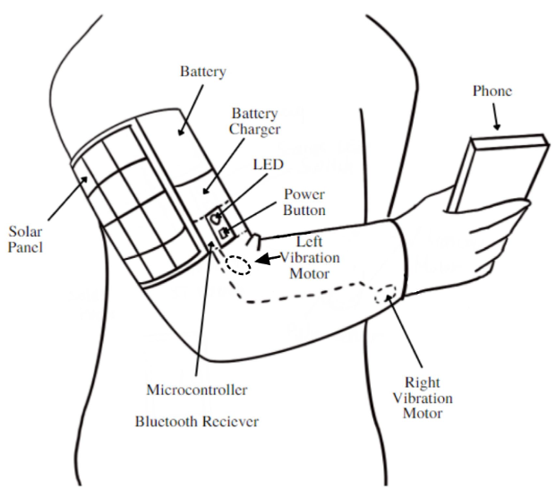
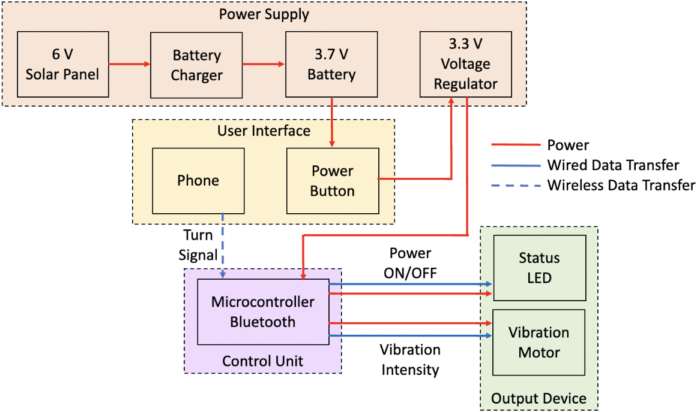
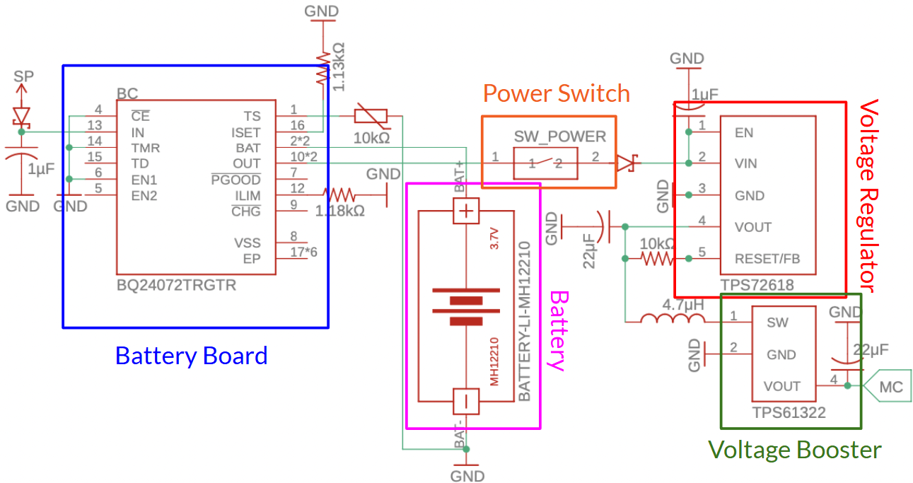
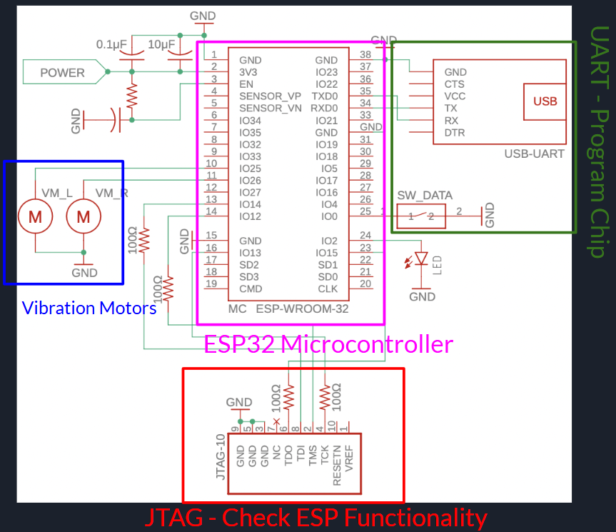
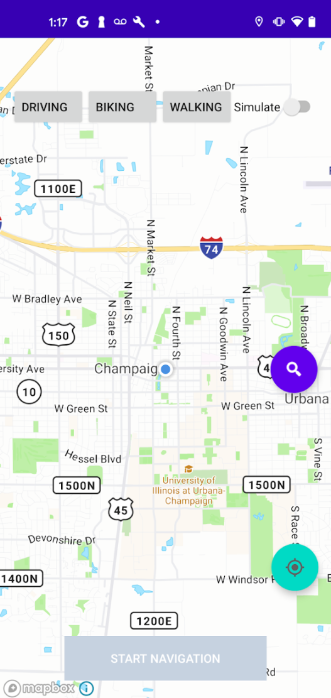

📌 Overview
---
This project introduces a wearable, vibration-based navigation device designed for cyclists and skateboarders. The system pairs with a mobile app and uses haptic feedback to communicate navigation cues, eliminating the need for screen interaction while riding. By leveraging Bluetooth connectivity and solar-powered endurance, this design aims to enhance both safety and usability.
- Project Duration: Feb 12, 2021 - May 5, 2021
- Tools: Arduino, Bluetooth Module, Solar Panel, Vibration Motors
---

🧰 Tools and Technologies
---
- Microcontroller: Arduino-compatible board
- Communication: Bluetooth (Classic, with plans for BLE)
- Power: Rechargeable Battery, Flexible Solar Panel
- Input: Companion Mobile App (Turn-by-turn navigation)
- Output: Dual Vibration Motors
---

🔍 Key Features
---
1. Distraction-Free Guidance
- Replaces phone-based instructions with left/right vibrations.
- Ensures the user's eyes and ears remain focused on the road.
2. App Integration
- Mobile app provides destination input and path calculation.
- Instructions transmitted via Bluetooth to wearable.
3. Haptic Feedback Control
- Differentiates turns via location, intensity, and timing of vibration.
- Supports manual intensity adjustment through the app.
4. Power Sustainability
- Designed for 1.5 hours minimum runtime per charge.
- Solar panel extends usage under daylight conditions.
---

🎨 Design
---
- Surface Design  
    
- Block Diagram  
    
- Power Supply  
    
- Microcontroller  
    
- App Design  
    