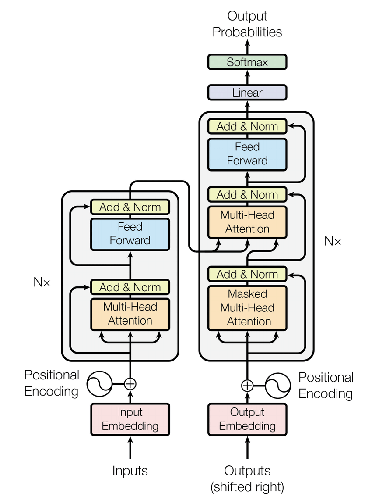

## Introduction

In machine learning, there are two methods of inference: **induction** and **transduction**.  
- **Inductive learning** is where the model learns a general rule \\( f: X \to Y \\) from training data and applies it to any unseen test data.  
- **Transductive learning** skips learning a general rule and instead focuses on predicting the outputs \\( Y_{\text{test}} \\) for the specific test inputs available during training.

Traditional sequence transduction models — such as RNNs, LSTMs, and GRUs — generate the output one token at a time, feeding the previous output back into the model as input. Because of their inherently sequential nature, these models **cannot be fully parallelized**, which limits computational efficiency.

To address this, the authors propose a new architecture called the **Transformer**, which completely eliminates recurrence. Instead of sequential dependencies, the Transformer uses **attention mechanisms only** to model relationships between tokens, allowing for much faster and more parallel computation.

Attention is a way for the model to **focus on relevant parts of the input** when generating each part of the output. Instead of treating all input tokens equally, attention lets the model weigh them differently depending on the context. Without attention, important dependencies — especially long-range ones — might be lost as information flows step by step through a recurrent model.

## Background

Previous attempts to reduce sequential computation include convolution-based models like ByteNet, ConvS2S, and the Extended Neural GPU. These models improve parallelism but still have trouble modeling long-range dependencies efficiently, since the number of operations needed to connect distant tokens grows with distance.

The **self-attention** mechanism introduced in the Transformer solves this by allowing each token to attend to **all other tokens simultaneously**, regardless of their distance. This enables the model to capture long-range dependencies in **constant time**, and to do so in a way that is fully parallelisable.

## Model Architecture

The Transformer is an **encoder-decoder model** built specifically for sequence transduction.

### Encoder and Decoder Stacks

- The **encoder** takes an input sequence  
  \\[
  \mathbf{x} = (x_1, x_2, \dots, x_n)
  \\]  
  and processes it into a sequence of continuous vector representations  
  \\[
  \mathbf{z} = (z_1, z_2, \dots, z_n),
  \\]  
  which capture the meaning and context of the input.

- The **decoder** generates an output sequence  
  \\[
  \mathbf{y} = (y_1, y_2, \dots, y_m)
  \\]  
  one token at a time, using the encoder output and its own previous outputs to ensure the output is fluent and grammatically consistent.

Each **encoder layer** consists of:
1. A **multi-head self-attention** mechanism.
2. A **position-wise feed-forward network**.

Each sublayer is wrapped with a **residual connection** and **layer normalisation**.

Each **decoder layer** has:
1. A **masked multi-head self-attention** layer.
2. An **encoder-decoder attention** layer.
3. A **feed-forward network**.

### Attention

Each token generates a **query**, **key**, and **value** vector. Attention compares each query to all keys using a dot product and weights the values accordingly.

Given:
- Queries \\( Q \in \mathbb{R}^{n_q \times d_k} \\)
- Keys \\( K \in \mathbb{R}^{n_k \times d_k} \\)
- Values \\( V \in \mathbb{R}^{n_k \times d_v} \\)

\\[
\text{Attention}(Q, K, V) = \text{softmax}\left( \frac{QK^\top}{\sqrt{d_k}} \right)V
\\]

- \\( QK^T \\): Computes similarity between queries and keys
- \\( \sqrt{d_k} \\): Prevents large dot products (stabilizes softmax)
- **Softmax**: Converts similarity scores into probabilities
- Final product with \\( V \\): Weighted sum of values

Suppose you’re writing a sentence and trying to decide what comes next. Your brain asks a question (query). It searches through everything you’ve already written (keys), and then picks out useful bits of information (values) based on how relevant they are.

Every word is doing this — looking around, figuring out what other words to focus on. The result is a weighted average of all the other words, where the weights are learned through training.

In **multi-head attention**, this is done in parallel with different perspectives:

\\[
\text{head}_i = \text{Attention}(QW_i^Q, KW_i^K, VW_i^V)
\\]
\\[
\text{MultiHead}(Q, K, V) = \text{Concat}(...\text{head}_i...)W^O
\\]

| Layer Type | Complexity | Sequential Ops | Max Path Length |
|------------|------------|----------------|-----------------|
| Self-Attn  | \\(O(n^2 \cdot d)\\) | \\(O(1)\\) | \\(O(1)\\) |
| RNN        | \\(O(n \cdot d^2)\\) | \\(O(n)\\) | \\(O(n)\\) |
| Conv       | \\(O(k \cdot n \cdot d^2)\\) | \\(O(1)\\) | \\(O(\log_k n)\\) |

### Positional Encoding

Self-attention has no sense of order. To inject positional information, the model adds **sinusoidal positional encodings** to each input embedding:

\\[
\text{PE}(pos, 2i) = \sin\left( \frac{pos}{10000^{2i/d}} \right)
\quad
\text{PE}(pos, 2i+1) = \cos\left( \frac{pos}{10000^{2i/d}} \right)
\\]

These encodings allow the model to reason about relative and absolute positions. They generalize well to sequences longer than those seen during training.

## Training and Optimisation

- Loss: Cross-entropy with **label smoothing** (\\( \epsilon = 0.1 \\))
- Optimizer: Adam with \\( \beta_1 = 0.9, \beta_2 = 0.98 \\)
- Learning rate schedule:

\\[
\text{lrate} = d^{-0.5} \cdot \min(\text{step}^{-0.5}, \text{step} \cdot \text{warmup}^{-1.5})
\\]

- Dropout and layer norm applied throughout
- Byte-Pair Encoding (BPE) used for tokenisation (vocab ~32K)

## Evaluation and Results

| Model             | BLEU (En→De) | BLEU (En→Fr) |
|------------------|--------------|--------------|
| GNMT + RL        | 24.6         | 39.0         |
| ConvS2S          | 25.2         | 40.5         |
| Transformer (base) | **27.3**     | **38.1**     |
| Transformer (big)  | **28.4**     | **41.8**     |

Beam search is used with a length penalty \\( \alpha = 0.6 \\). The model also performs well on parsing (92.7 F1), showing its generalisation power.

## Conclusion

The Transformer introduces a simple yet powerful architecture that outperforms previous models while being faster and more parallelisable. It’s entirely based on attention, with no recurrence or convolution. The ideas from this paper now underpin many modern NLP models including BERT, GPT, and T5 — attention really is all you need.