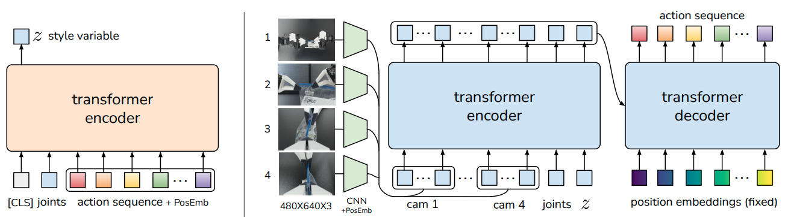

Paper: [Zhao et al. (2023), Learning Fine-Grained Bimanual Manipulation with Low-Cost Hardware](https://arxiv.org/abs/2304.13705).
This note focuses on the ACT policy; the paper also introduces the ALOHA hardware and demonstration system.

## Problem

Fine manipulation requires a sequence of precise commands, and imitation errors can push a robot into states poorly represented in demonstrations.
Human demonstrations can also contain different valid trajectories from similar observations.
ACT combines action chunking, conditional generative training, and temporal ensembling to address these difficulties. [§IV](https://arxiv.org/pdf/2304.13705#page=4).

## Previous Attempts

A policy that predicts one action per observation must repeatedly make local decisions across a long trajectory.
Predicting several future actions together gives the model a longer piece of demonstrated behaviour to reproduce.
However, executing an entire chunk before observing again delays feedback, while abruptly switching between successive chunks can produce jerky motion.
These are separate issues: the prediction horizon determines how much is generated, whereas the execution schedule determines when new observations affect control. [§IV-A and Fig. 5](https://arxiv.org/pdf/2304.13705#page=4).

## Proposed Solution

ALOHA collects demonstrations through a leader-follower joint-space interface, using two arms with parallel-jaw grippers and four cameras.
The observation records the follower robot's joint positions and camera images, while the demonstrated command records the leader's target joint positions.
These differ during contact and controller tracking, so recorded follower motion is not interchangeable with the intended command. [§III and §IV](https://arxiv.org/pdf/2304.13705#page=4).

Human pauses and corrections can depend on hidden intent or temporal context even when visible observations look similar.
This concerns the demonstrator's behaviour and the sufficiency of the observation; it does not redefine a Markov environment as one whose next action depends only on its state.
Chunking can represent such variation within a chunk, but it does not eliminate physical feedback or compounding error. [§IV-A](https://arxiv.org/pdf/2304.13705#page=5).

Let $o_t$ contain current camera images and joint positions, and let $A_t$ be the demonstrated future action chunk of length $H$.
The predicted chunk $\hat A_t$ contains target joint positions for successive controller steps.
The latent vector $z$ is an internal conditioning input; it is neither the observation nor the action chunk.
The [VAE/CVAE note](../../study-notes/machine-learning/autoencoders.qmd#vae) explains these object types.

During training, ACT's CVAE encoder reads $A_t$ and the current joint positions $\bar o_t$, omitting images:

$$
  z\sim q_\phi(z\mid A_t,\bar o_t).
$$

The policy decoder then predicts using the full observation and the sampled code:

$$
  \hat A_t=g_\theta(o_t,z).
$$

The demonstrated answer is available to the encoder during training because it comes from the dataset.
At deployment, ACT discards this encoder and uses $\hat A_t=g_\theta(o_t,0)$.
The observation still changes at every policy call. [§IV-B, Fig. 4, Algorithms 1–2](https://arxiv.org/pdf/2304.13705#page=5).

The objective combines reconstruction error and latent regularisation:

$$
  J=R_{\mathrm{L1}}+\beta K,
$$

$$
  K=D_{\mathrm{KL}}\!\left(
  q_\phi(z\mid A_t,\bar o_t)\Vert\mathcal N(0,I)
  \right).
$$

The L1 term compares predicted actions with demonstrated actions.
The KL term compares the encoder distribution with the prior, limiting how freely the training encoder can encode each answer.
These terms serve different purposes; a small KL value does not establish accurate actions.
The paper's Algorithm 1 labels reconstruction as MSE, but §IV-C explicitly reports using L1, consistent with the [released policy implementation](https://github.com/tonyzhaozh/act/blob/main/policy.py#L23-L30).

## Where the decoder's queries come from

{#fig-act-export-architecture fig-alt="ACT architecture showing a CLS and demonstration encoder, observation and latent memory, and future action positions" width="100%"}

The CVAE encoder prepends a learned `[CLS]` token to projected joint positions and demonstrated action tokens.
The resulting `[CLS]` representation parameterises the latent Gaussian.
In the policy, ResNet-18 features from each camera are flattened into spatial tokens and augmented with positional information before joining joint and latent tokens. [§IV-C and Appendix C](https://arxiv.org/pdf/2304.13705#page=5).

The CVAE decoder itself contains a transformer encoder and transformer decoder.
The transformer encoder combines image features, joint positions, and $z$ into a memory sequence $M$.
The transformer decoder has one output slot per future action.
Its cross-attention forms queries from the decoder's slot representations and keys and values from $M$.
Thus, encoded observations contribute keys and values; they do not supply the initial action-slot queries. [§IV-C](https://arxiv.org/pdf/2304.13705#page=6).

There is a paper/code distinction: the paper describes fixed sinusoidal decoder position embeddings, while the [released model](https://github.com/tonyzhaozh/act/blob/main/detr/models/detr_vae.py#L49-L51) uses a learned embedding for each slot.
The released [transformer](https://github.com/tonyzhaozh/act/blob/main/detr/models/transformer.py#L63-L66) starts slot content at zero and supplies these embeddings as query positions.
Later layers update the slot content through attention and feed-forward computation.
The [attention note](../../study-notes/machine-learning/attention.qmd#projections) explains why queries are learned projections, rather than literal questions or already known actions.

All action slots are processed in the same decoder pass and projected to actions together.
ACT does not generate one action, feed that completed action back, and then generate the next action autoregressively.
Joint prediction still permits interactions between slots through decoder self-attention. [Released decoder](https://github.com/tonyzhaozh/act/blob/main/detr/models/transformer.py#L206-L221).

## Temporal ensembling uses a common target time

Write $\hat a_{s\mid t}$ for the action intended for controller time $s$, predicted from the observation at time $t$.
With overlapping chunks, several policy calls can propose an action for the same target time.
For example, at time $11$, two eligible proposals could be $\hat a_{11\mid10}$ and $\hat a_{11\mid11}$.
Their second subscripts identify different observation times; their first subscripts identify the same execution time.

ACT queries the policy every controller step when temporal ensembling is enabled.
Let $b_i$ enumerate the available proposals for the current target time, ordered from oldest prediction to newest.
The executed action is

$$
  a_s=\frac{\sum_i w_i b_i}{\sum_i w_i},
  \qquad w_i=\exp(-mi).
$$

The paper assigns $i=0$ to the oldest prediction.
Consequently, positive $m$ gives older predictions greater weight; reducing $m$ makes newer observations relatively more influential, and $m=0$ gives equal weights.
Reversing the index order reverses that interpretation. [§IV-A and Algorithm 2](https://arxiv.org/pdf/2304.13705#page=5).
The released [execution code](https://github.com/tonyzhaozh/act/blob/main/imitate_episodes.py#L229-L238) follows the same oldest-first convention.

This averages predictions about one time, rather than smoothing together commands intended for different times.
It can soften chunk transitions while incorporating fresh observations.

## Evidence

The paper evaluates task success on simulated and real manipulation tasks and compares ACT with several imitation baselines. [§V](https://arxiv.org/pdf/2304.13705#page=7).
Its ablations separate action chunking, temporal ensembling, and CVAE training.
Chunking helps the tested policies; temporal ensembling helps ACT and the tested direct regression baseline but hurts the retrieval baseline.
Removing CVAE training has much greater impact for the tested human demonstrations than for scripted demonstrations. [§VI and Fig. 8](https://arxiv.org/pdf/2304.13705#page=10).
These results support the components in the reported settings, rather than a guarantee that every dataset requires a CVAE or benefits from averaging.

## Limitations

The deterministic choice $z=0$ does not sample the full learned conditional distribution at deployment.
The code's latent coordinates also lack guaranteed semantic meanings.
The authors report difficulty learning candy unwrapping and opening a small plastic bag, attributing these failures to perception and data limitations. [Appendix F](https://arxiv.org/pdf/2304.13705#page=16).
Temporal ensembling cannot guarantee that averaging two valid strategies yields a valid command, especially when their trajectories choose different sides of an obstacle.
That is a structural limitation of averaging, and motivates the continuity discussion in [IRTC](irtc.qmd).

## Connections

[Generative action models](../../study-notes/machine-learning/generative-models.qmd#questions) separates the action representation, training target, generation procedure, and execution schedule.
[Loss](../../study-notes/machine-learning/loss.qmd#mae) explains the L1 penalty used for reconstruction.
[Diffusion Policy](diffusion-policy.qmd) generates a chunk by iterative denoising and usually executes a selected prefix before replanning.
