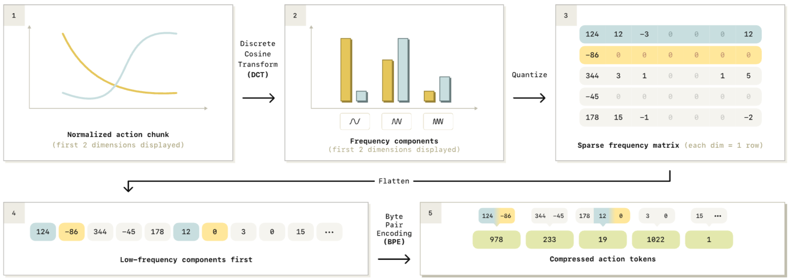

Paper: [FAST: Efficient Action Tokenization for Vision-Language-Action Models](https://arxiv.org/abs/2501.09747).

## Problem: many tokens can describe little change

A robot action chunk $A\in\mathbb R^{H\times d_a}$ contains $H$ time positions and $d_a$ action coordinates.
Binning every scalar independently can produce $H d_a$ tokens.
At high control frequencies, adjacent samples of a smooth motion are similar, so many of those tokens repeat nearly the same information.

The paper's interpolation experiment varies the sampling frequency of the same underlying curves.
Its results show that the naive tokenisation can make autoregressive fitting harder even though the underlying trajectory problem has not become more complex.
This supports a representation problem in that experiment, rather than a general impossibility result.
See [FAST, §III–IV and Figure 3](https://arxiv.org/abs/2501.09747).

## The forward transformation {#pipeline}

FAST first normalises actions using fixed training-data quantiles, as explained in [Inputs, tokens, and normalisation](../../study-notes/robotics/quantile-normalization.qmd#quantile-scaling).
It then applies four operations:

1. Transform each coordinate's time series into cosine coefficients.
2. Scale and round those coefficients to integers.
3. Serialise the coefficient matrix with low frequencies first.
4. Encode repeated symbol patterns with byte-pair encoding (BPE).

These are the stages of [Figure 4 and Algorithm 1](https://arxiv.org/abs/2501.09747).
The DCT and rounding are fixed numerical operations; the learned component of FAST is its BPE vocabulary and merge rules.

{#fig-fast-export-pipeline fig-alt="Five stages showing action curves, cosine coefficients, quantised values, frequency-first serialisation, and BPE tokens" width="100%"}

The figure draws one row per action coordinate; the equations below use a matrix with frequency rows.

## DCT expresses a trajectory through temporal patterns {#dct}

Let $D_H$ be the orthonormal discrete cosine transform matrix acting along time.
For normalised actions $\widetilde A$,

$$
  C=D_H\widetilde A,
  \qquad C\in\mathbb R^{H\times d_a}.
$$

Row $k$ now represents a temporal frequency, rather than a controller timestep.
The lowest coefficient describes a constant component; higher coefficients describe increasingly rapid variation across the chunk.
Each coordinate is transformed independently.
The [released processor](https://huggingface.co/physical-intelligence/fast/blob/main/processing_action_tokenizer.py) uses the orthonormal DCT along the time axis.

The transform alone retains all $H d_a$ numbers and is invertible.
Compression becomes possible when many small coefficients can be rounded to zero and repeated symbol sequences encoded compactly.
FAST's motivation is that smooth trajectories often concentrate useful structure in relatively few coefficients.

::: {.callout-note collapse="true" icon="false" title="Derivation: the cosine basis and a constant trajectory"}

For time index $h=0,\ldots,H-1$ and frequency index $k=0,\ldots,H-1$, define

$$
  \theta_{hk}=\frac{\pi(h+1/2)k}{H}.
$$

The orthonormal DCT-II is

$$
  C_{kj}=\alpha_k\sum_{h=0}^{H-1}
  \widetilde A_{hj}\cos\theta_{hk},
$$

where $\alpha_0=1/\sqrt H$ and $\alpha_k=\sqrt{2/H}$ for $k>0$.
These factors make $D_H^\top D_H=I$; see the [SciPy DCT definition](https://docs.scipy.org/doc/scipy/reference/generated/scipy.fft.dct.html).

For $H=4$ and one coordinate with values $[0.5,0.5,0.5,0.5]$, the coefficients are $[1,0,0,0]$.
The constant component contains the whole trajectory.
The inverse recovers four actions, rather than issuing one action of magnitude $1$.

:::

A Fourier transform is also a possible temporal representation.
The DCT offers a real cosine basis and an [even-extension interpretation](https://www.fftw.org/fftw3_doc/Real-even_002fodd-DFTs-_0028cosine_002fsine-transforms_0029.html), which can suit finite smooth segments whose endpoints differ.
It is not justified by the claim that robot motion contains “no sine waves.”
The [paper, §V-A](https://arxiv.org/abs/2501.09747), motivates DCT through simplicity, efficiency, and compression properties; it does not establish DCT as uniquely optimal among transforms.

## Quantisation loses precision; BPE preserves symbols {#quantisation-and-bpe}

For scale $\gamma>0$, FAST rounds each coefficient:

$$
  Q_{kj}=\operatorname{round}(\gamma C_{kj}).
$$

Larger $\gamma$ preserves finer distinctions, typically at the cost of weaker compression.
With $\gamma=10$, coefficients $0.034$ and $0.041$ both become integer zero, so their difference is lost.
This zeros small coefficients wherever they occur; it does not simply delete every high-frequency coefficient.

Serialisation lists the coefficients for all action coordinates at frequency zero, then those at frequency one, and so on.
Thus early symbols describe broad trajectory structure across coordinates.
The paper reports that this order gave more stable rollouts than listing every frequency of one coordinate before proceeding to the next.

BPE learns to replace frequent adjacent symbol pairs with vocabulary entries, and subsequent merges can represent longer patterns.
For a toy dictionary in which $Z$ represents the pair $(0,0)$, the symbol sequence $[3,0,0,0,0]$ could become $[3,Z,Z]$.
Expanding the dictionary entries recovers the original five symbols exactly.
These illustrative symbols are not IDs from the released tokenizer.

BPE is therefore lossless for the encoded symbol sequence, while FAST as a whole is lossy because of coefficient quantisation.
A FAST token can cover several coefficients, potentially spanning coordinates or frequencies; it does not necessarily represent one physical action or timestep.
See [FAST, §V-B](https://arxiv.org/abs/2501.09747).

## Decoding and what can be recovered {#decoding}

Decoding expands BPE tokens, restores the coefficient matrix using the known horizon and action dimension, divides by $\gamma$, and applies inverse DCT:

$$
  \widehat{\widetilde A}=D_H^\top\frac Q\gamma.
$$

The final step inverts the action normalisation and any robot-specific coordinate transforms.
It reconstructs a continuous chunk approximating the original demonstration.

::: {.callout-note collapse="true" icon="false" title="Derivation: where reconstruction error enters"}

With exact BPE decoding and no additional clipping, write $\widehat C=Q/\gamma$.
Nearest-integer rounding gives

$$
  |\widehat C_{kj}-C_{kj}|\leq\frac{1}{2\gamma}.
$$

Orthogonality preserves the total squared error:

$$
  \|\widehat{\widetilde A}-\widetilde A\|_F^2
  =\|\widehat C-C\|_F^2.
$$

The Frobenius norm sums squared errors over all entries.
Unnormalisation rescales errors into physical units.
This bound excludes incorrectly predicted tokens.

:::

The [released processor](https://huggingface.co/physical-intelligence/fast/blob/main/processing_action_tokenizer.py) also clamps coefficient offsets below its trained minimum before converting them to symbols.
Consequently, the pure rounding bound assumes coefficients remain inside the supported encoding range.
The inverse needs the same scale, dictionary, ordering, horizon, and action dimensions as the forward path.

## Tokenisation and the policy objective {#training-and-inference}

Given observation context $o$ and FAST targets $z^*_{1:K}$, an autoregressive policy trains with

$$
  L_{\mathrm{token}}
  =-\sum_{i=1}^{K}
  \log p_\theta(z_i^*\mid o,z_{<i}^*).
$$

Teacher forcing supplies preceding target tokens during training; generation uses the policy's preceding outputs.
The target is a vocabulary entry, so this is [cross-entropy](../../study-notes/mathematics/entropy.qmd#cross-entropy), not action-coordinate MSE.
FAST compresses the targets; it does not itself predict which trajectory the robot should perform.

The [$\pi_{0.5}$ paper, §IV-B–D](https://arxiv.org/abs/2504.16054), uses discrete action learning alongside a continuous flow expert during its training recipe.
Its flow expert generates low-level continuous actions without decoding FAST tokens first.
The [model note](pi05.qmd) and [knowledge insulation](knowledge-insulation.qmd) connect these branches to the [velocity-prediction objective](../../study-notes/machine-learning/generative-models.qmd#questions).

## Evidence and limits

FAST's experiments support compression as a useful way to train autoregressive policies on the studied action datasets.
Decorrelation here means reducing predictable temporal redundancy; a DCT does not guarantee statistically independent coefficients or make every token contain unique information.
Faster training convergence also does not imply faster deployment: a FAST policy still decodes a sequence through the backbone, whereas a flow policy can reuse observation features while a smaller expert refines its chunk.
The paper's training and inference comparisons concern its particular models and hardware, rather than universal latency constants for either representation.
FAST+ supplies a BPE vocabulary trained across robot datasets, reducing the need to fit a tokenizer for each dataset.
Neither establishes universal reconstruction fidelity or identical meanings for coordinates from different robots.
Quantisation, unsupported values, predicted token errors, and sequential decoding remain relevant limitations.
The [paper's evaluation and limitations](https://arxiv.org/abs/2501.09747) should be read with those distinctions in mind.
