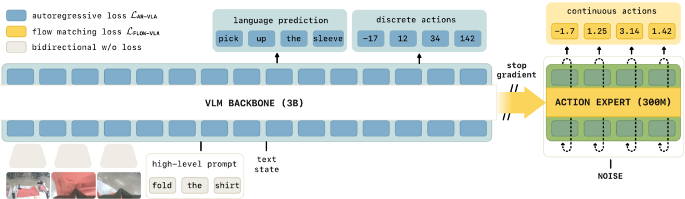

Paper: [Driess et al. (2025), arXiv:2505.23705v1](https://arxiv.org/abs/2505.23705v1).

## Problem

A pretrained vision-language model can distinguish “pick up the spoon” from “pick up the wrapper,” but adapting it to robot control may weaken that distinction.
A continuous action expert adds useful control capacity and also introduces newly initialized parameters into training.
If its loss backpropagates through the backbone, those new parameters influence how the pretrained representations change.
The paper investigates whether this interaction harms language following and how to preserve useful transfer while still learning robotics. [Paper, Sections 1 and 4](https://arxiv.org/pdf/2505.23705v1#page=5).

**Knowledge insulation** here means blocking the action expert's gradient into the backbone while giving the backbone its own robot-learning objective.
It does not mean freezing the backbone or preventing the expert from reading backbone features.

## Previous Attempts

An autoregressive policy such as π0-FAST adapts the backbone directly through discrete action prediction, but sequential decoding adds inference cost.
[π0](pi0.qmd) uses a smaller continuous expert for fast action generation, while its action-learning gradients also train the backbone.
Freezing a pretrained VLM avoids changing its representations, but the paper's frozen-backbone baselines perform poorly on its robot tasks. [Paper, Section 4 and Figures 4–8](https://arxiv.org/pdf/2505.23705v1#page=8).

The resulting design problem has two parts: the backbone needs a useful robotics learning signal, and the continuous expert needs access to the resulting representations.

## Proposed Solution

**Train two action representations jointly.**
The recipe initializes the backbone from PaliGemma and adds a smaller, newly initialized action expert.
The backbone predicts language and [FAST action tokens](fast.qmd) through next-token cross-entropy, while the expert learns continuous flow velocities.
Vision-language examples contribute their available token targets; robot examples also contribute action supervision.
The two outputs can be trained in the same recipe without requiring every example to contain both types of targets. [Paper, Section 5.1 and Equation (4)](https://arxiv.org/pdf/2505.23705v1#page=6).

{#fig-knowledge-insulation fig-alt="Language and discrete action targets train the VLM; the continuous expert reads VLM features through a stop-gradient boundary" width="100%"}

For a robot example, write the objective schematically as

$$
    \mathcal{L}
    =\mathcal{L}_{\mathrm{tokens}}
    +\alpha\mathcal{L}_{\mathrm{flow}}.
$$

The paper's masks choose which token positions and examples contribute to each loss.
With the noise-at-zero convention used in these notes, the expert receives $A^\tau=(1-\tau)\epsilon+\tau A$ and learns velocity $A-\epsilon$.
The paper prints the opposite target beside that interpolation in Section 3, page 4; the [π0 note](pi0.qmd) explains the sign convention and its relation to the implementation.

**Discrete prediction gives the backbone an independent reason to learn robot actions.**
If the command changes from spoon to wrapper, the demonstrated action tokens can change too.
Predicting those tokens therefore rewards backbone representations that preserve action-relevant distinctions in images, language, and state.
Once this learning signal exists, the flow loss can be blocked at the backbone boundary while the expert still learns to use the features.
This is the role of the discrete branch; it does not require discrete decoding to be the better deployed controller. [Paper, Sections 5.1–5.2](https://arxiv.org/pdf/2505.23705v1#page=6).

**Attention masks and stop-gradient control different things.**
The backbone and expert have aligned transformer layers with separate weights and compatible query, key, and value dimensions.
The expert reads the image-language-state prefix at each layer, and action positions can read one another.
FAST tokens cannot read the continuous actions, continuous actions cannot read FAST tokens, and the prefix cannot read the expert.
These attention rules control forward information access and prevent one target representation from revealing the answer to the other. [Paper, Appendix B](https://arxiv.org/pdf/2505.23705v1#page=18).

Stop-gradient instead controls the derivative of an allowed read.
The expert receives the same backbone keys and values in the forward pass, but its loss cannot update the parameters that produced those backbone features.
Both keys and values need this treatment: attention scores depend on keys, while the weighted content depends on values. [Paper, Equations (5)–(6)](https://arxiv.org/pdf/2505.23705v1#page=6).

::: {.callout-note collapse="true" icon="false" title="Derivation: insulating an attention read"}
Suppress head indices and output projections, and let $b$ denote permitted backbone-prefix positions and $a$ expert positions at one layer.
The expert supplies its own $Q_a$; state information is part of the prefix's $K_b,V_b$.
Define detached copies

$$
    \bar K_b=\operatorname{sg}(K_b),
    \qquad \bar V_b=\operatorname{sg}(V_b).
$$

Here $\operatorname{sg}(x)=x$ during evaluation, but its derivative is defined as zero for backpropagation.
The attention probabilities jointly normalize over permitted backbone and expert sources:

$$
    \begin{aligned}
        S_{ab}&=Q_a\bar K_b^\top/\sqrt{d_k},\\
        S_{aa}&=Q_aK_a^\top/\sqrt{d_k},\\
        [P_{ab},P_{aa}]&=\operatorname{softmax}
        ([S_{ab},S_{aa}]+M).
    \end{aligned}
$$

$M$ assigns negative infinity to forbidden reads.
The expert's attention result is

$$
    Z_a=P_{ab}\bar V_b+P_{aa}V_a.
$$

Gradients still train $Q_a,K_a,V_a$ and the expert's subsequent operations.
The backbone's own attention uses ordinary, undetached backbone features, so its token-prediction loss continues to update those parameters.
These equations express the intended routing in the paper's Section 5.2 without confusing an attention mask with a gradient boundary.
:::

::: {.callout-note collapse="true" icon="false" title="Derivation: which loss updates which parameters"}
Let $h_\phi(c)$ stand for the collection of backbone features supplied to the expert, and let $g_\psi$ denote the expert.
The insulated flow prediction is

$$
    v=g_\psi(A^\tau,\operatorname{sg}(h_\phi(c)),\tau).
$$

The chain rule through the detached features gives

$$
    \nabla_\phi\mathcal{L}_{\mathrm{flow}}=0.
$$

Under this routing, the objective supplies

$$
    \begin{aligned}
        \nabla_\phi\mathcal{L}
        &=\nabla_\phi\mathcal{L}_{\mathrm{tokens}},\\
        \nabla_\psi\mathcal{L}
        &=\alpha\nabla_\psi\mathcal{L}_{\mathrm{flow}}.
    \end{aligned}
$$

The backbone still learns through token supervision.
Freezing would suppress that adaptation as well.
The paper uses $\alpha=1$ with insulation because the two loss terms act on independent parameter sets; optimizer details still determine actual update sizes. [Paper, Section 5.2](https://arxiv.org/pdf/2505.23705v1#page=6).
:::

**Inference uses the learned features and continuous expert.**
For low-level control, form the observation prefix, sample action noise, and integrate the predicted flow to obtain a continuous chunk.
The discrete action branch supplied a representation-learning target during training; it need not generate FAST tokens during this control inference.
Stop-gradient has no numerical effect on inference because no parameter-update gradient is being computed. [Paper, Figure 1 and Section 5](https://arxiv.org/pdf/2505.23705v1#page=2).

## Evidence

The paper compares insulation with ordinary joint training, pretrained-backbone freezing, and alternative action architectures.
Its task and language-following results support protecting the backbone and co-training on vision-language data, while some joint-training variants also follow language well when given that data. [Paper, Figures 4–7 and Section 6](https://arxiv.org/pdf/2505.23705v1#page=9).
The state ablation finds the method works with both text and continuous state, so its benefits cannot be attributed solely to state tokenization. [Paper, Figure 10](https://arxiv.org/pdf/2505.23705v1#page=16).

## Limitations

Language following remains imperfect, and training both output representations adds work per training step.
The evidence supports this recipe in the evaluated settings; it does not prove every continuous adapter damages every pretrained backbone. [Paper, Section 7](https://arxiv.org/pdf/2505.23705v1#page=10).
The method is related to π0.5's hybrid objectives, but its explicit stop-gradient rule should not be retroactively inserted into the original [π0.5 recipe](pi05.qmd).

## Connections

[Attention](../../study-notes/machine-learning/attention.qmd#projections) explains queries, keys, values, and masks; [representations](../../study-notes/machine-learning/representations.qmd) explains why text state differs from a continuous state token.
[Cross-entropy](../../study-notes/mathematics/entropy.qmd#cross-entropy) and [generative action models](../../study-notes/machine-learning/generative-models.qmd#questions) describe the two learning targets.
[Loss functions](../../study-notes/machine-learning/loss.qmd#loss-and-risk) provides the broader distinction between an objective and the parameters its gradient can update.
[π*0.6](pi06.qmd) uses insulation inside a larger training loop that adds value-based improvement labels and robot experience.
