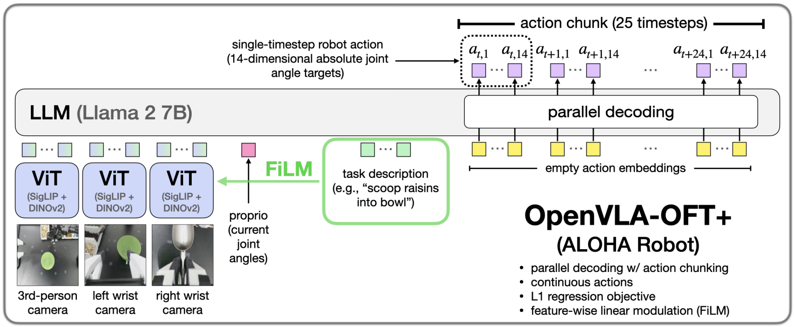

Paper: [Kim et al. (2025), Fine-Tuning Vision-Language-Action Models: Optimizing Speed and Success](https://arxiv.org/abs/2502.19645).

## Problem

A pretrained VLA's original prediction format need not be the best format for adapting it to a particular robot.
Original OpenVLA generates action coordinates sequentially as discrete tokens, which becomes costly for longer chunks or bimanual actions.
OpenVLA-OFT studies which fine-tuning choices improve task success and action-generation efficiency. [§§I–III](https://arxiv.org/pdf/2502.19645#page=3).

## Previous Attempts

Retaining the original autoregressive recipe is straightforward, but a chunk with $H$ timesteps and $d_a$ coordinates requires $H d_a$ scalar-token predictions.
Action chunking is therefore possible under autoregression; its sequential cost can make it impractical at high control frequencies.
Diffusion and flow policies can generate chunks through iterative refinement, introducing a different computation trade-off.
OFT compares these choices empirically rather than assuming that a more expressive generative objective must perform better on every adaptation task. [§§III–IV](https://arxiv.org/pdf/2502.19645#page=3).

## Proposed Solution

The OFT recipe inserts empty action embeddings for the desired output positions, enables parallel attention-based processing, and projects their final hidden states to numerical actions.
Its chosen continuous-action variant trains an MLP action head with an L1 objective.
For a predicted chunk $\hat A$ and demonstration $A$,

$$
  L_{\mathrm{L1}}=
  \frac{1}{H d_a}\sum_{h=1}^{H}\sum_{j=1}^{d_a}
  |\hat A_{hj}-A_{hj}|.
$$

All output coordinates are computed in one forward pass, rather than feeding one completed action token back to produce the next.
Bidirectional attention between output positions allows their hidden representations to interact before the final numerical projection.
The pretrained backbone still contributes its learned representations; the action head and decoding procedure change during adaptation. [§IV-B](https://arxiv.org/pdf/2502.19645#page=4).

| Choice | Original OpenVLA | OFT recipe |
|---|---|---|
| Outputs | Discrete action bins | Continuous coordinates |
| Generation | Autoregressive | Parallel action positions |
| Main objective | Token cross-entropy | L1 action error |
| Chunking | Sequential cost grows | Multiple timesteps in one pass |

The recipe can also incorporate multiple camera views and a projected proprioceptive input.
These are extensions of the original single-image interface, not evidence that every OpenVLA model already receives robot state. [§IV-B](https://arxiv.org/pdf/2502.19645#page=4).

## FiLM in the OFT+ variant

{#fig-oft-aloha fig-alt="OpenVLA OFT plus model using three camera views, joint state, FiLM, and empty action embeddings for parallel output" width="100%"}

The paper adds feature-wise linear modulation (FiLM) for its ALOHA experiments and denotes this variant OFT+.
It averages instruction embeddings and projects that representation into scaling and shifting vectors for visual hidden channels:

$$
  \widehat F=(1+\gamma)\odot F+\beta.
$$

Each channel's scaling and shift are shared across visual patch positions.
This differs from assigning an unrelated modulation value to each patch.
The modulation is inserted inside the vision-transformer blocks to strengthen language influence on visual features. [§IV-C](https://arxiv.org/pdf/2502.19645#page=4).

## Evidence

The paper compares decoding strategies, representations, and objectives on LIBERO, then evaluates an adapted bimanual system on ALOHA.
Its chosen L1 variant attains comparable performance to the tested diffusion variant with faster training and inference in those settings.
The reported throughput improvements combine parallel generation with generating multiple actions per call; throughput and latency are different measurements. [§§V–VI](https://arxiv.org/pdf/2502.19645#page=5).

## Limitations

Direct L1 prediction does not explicitly sample a multimodal action distribution.
Its strong results on these benchmarks do not establish that deterministic regression always handles ambiguous demonstrations as well as a generative policy.
The OFT+ language intervention is evaluated in a particular multi-camera setting, and executing a chunk still delays the next opportunity for observation-based replanning.

## Connections

[OpenVLA](openvla.qmd) explains the original visual and token interfaces.
[ACT](act.qmd) also predicts action chunks jointly, but uses CVAE training and can apply temporal ensembling.
[Diffusion Policy](diffusion-policy.qmd) distinguishes a denoising objective from direct action-coordinate error.
[Loss](../../study-notes/machine-learning/loss.qmd#mae) and [attention](../../study-notes/machine-learning/attention.qmd#action-positions) explain the L1 objective and output-slot computation.
