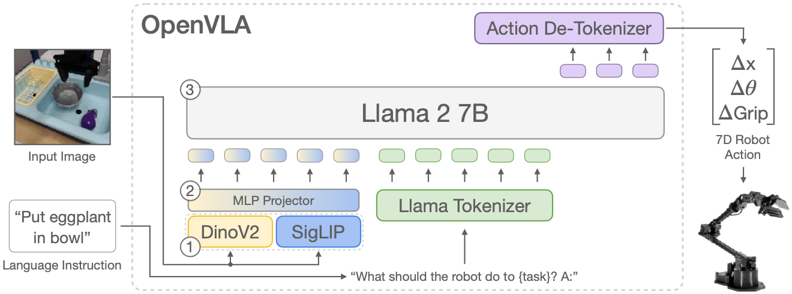

Paper: [Kim et al. (2024), OpenVLA](https://arxiv.org/abs/2406.09246).

## Problem

Robot control should benefit from the visual and language representations of pretrained models while remaining adaptable to new robot tasks.
OpenVLA provides a public vision-language-action model and studies transfer, fine-tuning, and deployment of this architecture.
Its base policy receives an image and a language instruction and predicts a robot action as a short sequence of discrete tokens. [§§1 and 3](https://arxiv.org/pdf/2406.09246#page=4).

## Previous Attempts

Prior VLAs such as RT-2 establish that action prediction can be expressed in a language model's output vocabulary.
OpenVLA builds on the Prismatic VLM and a diverse Open X-Embodiment training mixture, rather than requiring a new language architecture for each robot.
Its contribution includes the training recipe and evaluation of adaptation methods, alongside the released model. [§§2–3](https://arxiv.org/pdf/2406.09246#page=3).

## Proposed Solution

{#fig-openvla-architecture fig-alt="Image through DINOv2 and SigLIP, visual projection and language tokenisation, Llama 2, and action detokenisation" width="100%"}

An image passes through DINOv2 and SigLIP separately.
Their corresponding patch features are concatenated along the feature dimension and projected by an MLP into the language backbone's embedding space.
The model retains a sequence of patch representations; this is not simply global pooling into one image vector.
DINOv2 contributes visual features found useful for spatial reasoning, while SigLIP supplies representations learned through image-language training.
These motivations do not assign an exclusive geometry or semantics role to every feature. [§3.1](https://arxiv.org/pdf/2406.09246#page=4).

The task instruction is tokenised and embedded through the language model.
The resulting image and language embeddings have compatible widths and enter the Llama 2 7B backbone together.
During training, preceding target action tokens also enter the sequence through teacher forcing.
They are supervision-derived inputs; they are unavailable at deployment. [§3.2](https://arxiv.org/pdf/2406.09246#page=5).

## From numerical commands to token targets

For each action coordinate, OpenVLA divides a training-data interval into 256 bins.
The interval uses the 1st and 99th percentiles to reduce sensitivity to outliers, rather than a universal physical range shared by every coordinate.
Each coordinate becomes a bin index in $\{0,\ldots,255\}$.
In the common seven-dimensional setting, three coordinates describe translation, three describe rotation, and one controls the gripper. [§3.2 and Fig. 2](https://arxiv.org/pdf/2406.09246#page=5).

OpenVLA reuses the last 256 entries of the language tokenizer's vocabulary for action bins.
These are shared bin symbols whose coordinate roles come from sequence position and the action convention.
They are not separate named vocabularies such as an independent `action_x_159` for every dimension.
Literal vocabulary IDs and special-token strings should be checked against the released tokenizer rather than inferred from a schematic list.

Let $c$ denote image-language context and $b_1,\ldots,b_{d_a}$ the demonstrated action-bin sequence.
The policy factorises its prediction as

$$
  p_\theta(b_{1:d_a}\mid c)
  =\prod_{j=1}^{d_a}p_\theta(b_j\mid c,b_{<j}).
$$

The objective sums next-token cross-entropy at the action positions:

$$
  L=-\sum_{j=1}^{d_a}\log p_\theta(b_j\mid c,b_{<j}).
$$

At inference, the model conditions each generated token on its own previous outputs, then maps the completed bin sequence back to a numerical command.
The original policy does not require a proprioceptive input; adding robot state or multiple camera views changes its input recipe. [§3.2 and §6](https://arxiv.org/pdf/2406.09246#page=5).

## Evidence

The paper evaluates generalist control and adaptation to new tasks, including comparisons with other VLAs and imitation policies.
Its fine-tuning experiments support using the pretrained model for the tested target tasks and examine parameter-efficient adaptation and quantisation. [§4](https://arxiv.org/pdf/2406.09246#page=7).
The comparisons also vary training data and model design, so performance differences should not be attributed solely to the two visual encoders.

## Limitations

Scalar binning introduces quantisation error, and autoregressive decoding adds sequential computation for each coordinate.
Predicting longer chunks is possible in principle but multiplies the number of output tokens under naive scalar tokenisation.
The original model's single-image input also limits information available for control.
None of the tokenisation or pretraining choices imposes collision avoidance or guarantees correct language following.

## Connections

[OpenVLA-OFT](openvla-oft.qmd) changes fine-tuning and decoding to predict continuous chunks in parallel.
[FAST](fast.qmd) instead compresses action chunks while retaining autoregressive token prediction.
[Representations](../../study-notes/machine-learning/representations.qmd) distinguishes token IDs from embeddings, and [cross-entropy](../../study-notes/mathematics/entropy.qmd#cross-entropy) derives the prediction loss.
