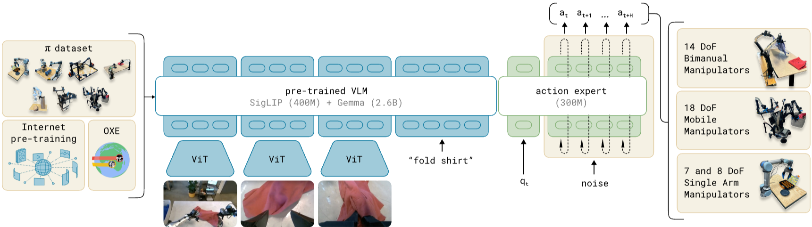

Paper: [Black et al. (2024), arXiv:2410.24164v1](https://arxiv.org/abs/2410.24164v1).
This note covers the original architecture and training recipe.

## Problem

A robot policy must connect a command such as “fold the shirt” to continuous commands for a particular body in its current configuration.
Recognizing a shirt does not specify how two grippers should move together over the next second.
π0 asks how a pretrained vision-language model (VLM) can support this precise, temporally coordinated control across different robots.

The prediction is a conditional distribution over an **action chunk**, a sequence of future commands.
Write $A\in\mathbb{R}^{H\times d_a}$ for $H$ commands with $d_a$ coordinates each, and $c=(I,\ell,q)$ for camera images, a language instruction, and the current robot state.
The policy models $p(A\mid c)$; different samples can represent different demonstrated ways of acting in the same situation.

## Previous Attempts

Autoregressive VLAs represent actions as discrete tokens, making robot learning compatible with language-model training but requiring sequential token generation.
[ACT](act.qmd) and [Diffusion Policy](diffusion-policy.qmd) model action chunks for coordinated manipulation.
π0 combines chunk generation with a pretrained VLM and a smaller transformer expert specialized for continuous actions. [Paper, Sections II–IV](https://arxiv.org/pdf/2410.24164v1#page=3).

## Proposed Solution

**Pretrained knowledge and new action parameters.**
The VLM starts from PaliGemma's pretrained weights, including its vision-language components.
The approximately 300-million-parameter action expert starts from scratch.
The expert is a second set of transformer weights, with layers aligned with the backbone layers and compatible attention dimensions.
Tokens use their assigned weight set; the two streams exchange information through attention at each layer. [Paper, Section IV and Appendix B](https://arxiv.org/pdf/2410.24164v1#page=15).

{#fig-pi0-architecture fig-alt="Original pi0 architecture with image and language tokens in a pretrained VLM and state and action tokens in a smaller action expert" width="100%"}

**Three blocks explain where state goes.**
The sequence contains an image-and-language block, one projected state token, and a block of noisy action tokens.
The state token is a learned linear projection of the continuous vector $q$.
Each action position is embedded from its noisy command together with an encoding of flow time.
The attention mask permits the following reads:

| Query block | Can attend to |
|---|---|
| Images and language | Images and language |
| State | Images, language, and state |
| Noisy actions | Images, language, state, and all noisy actions |

State is therefore available to every action position even though it is never corrupted with action noise.
Its block cannot read noisy actions, so its keys and values can be cached while those actions change during generation. [Paper, Appendix B](https://arxiv.org/pdf/2410.24164v1#page=15).

**The state $q$ is different from an attention query $Q$.**
Every token produces query, key, and value projections from its own current hidden representation.
For an action token, its query comes from that action token's hidden vector, which initially represents a noisy action and flow time.
It compares that query with keys from all permitted tokens, including the state token, and receives a weighted combination of their values.
Later layers operate on representations already enriched by previous attention operations.

::: {.callout-note collapse="true" icon="false" title="Derivation: how an action token reads state"}
For one attention head, let $h_i$ be an action token's input to the attention layer and $\mathcal{S}_i$ its permitted source positions.
Its projections use the action expert's weights:

$$
    Q_i=h_iW_Q^a.
$$

Each source $j$ supplies $K_j$ and $V_j$ using its own stream's projections.
The action token receives

$$
    \begin{aligned}
        s_{ij}&=Q_iK_j^\top/\sqrt{d_k},\\
        w_{ij}&=\frac{e^{s_{ij}}}
        {\sum_{r\in\mathcal{S}_i}e^{s_{ir}}},\\
        z_i&=\sum_{j\in\mathcal{S}_i}w_{ij}V_j.
    \end{aligned}
$$

The state contributes through its key and value in this sum.
It also has its own query for updating the state token itself.
Thus, assigning all queries to state and all keys and values to noise would remove the actual token-by-token computation.
The [attention note](../../study-notes/machine-learning/attention.qmd#projections) develops the general operation.
:::

**Training predicts a velocity, conditioned on clean observations.**
Use noise at $\tau=0$ and demonstrated data at $\tau=1$:

$$
    \begin{aligned}
        A^\tau&=(1-\tau)\epsilon+\tau A,\\
        \epsilon&\sim\mathcal{N}(0,I).
    \end{aligned}
$$

The network receives $(A^\tau,c,\tau)$ and predicts a vector with the same shape as the chunk.
For this convention, its target is $u=A-\epsilon$ and its loss is

$$
    \mathcal{L}_{\mathrm{flow}}
    =\mathbb{E}\|v_\theta(A^\tau,c,\tau)-u\|^2.
$$

Training samples an intermediate time and supervises the velocity there.
The clean demonstrated chunk constructs the noisy input and target; it is not supplied as an extra clean action sequence to the model.
The images, instruction, and state remain conditioning inputs throughout.

::: {.callout-note collapse="true" icon="false" title="Derivation: flow direction and source notation"}
Differentiating the specified path gives

$$
    \frac{dA^\tau}{d\tau}=A-\epsilon.
$$

For fixed $A$, scaling the Gaussian noise by $1-\tau$ scales its covariance by $(1-\tau)^2$.
Therefore, the interpolation has conditional distribution

$$
    A^\tau\mid A\sim
    \mathcal N\!\left(\tau A,(1-\tau)^2I\right).
$$

The noise coefficient is a standard-deviation multiplier, not a covariance multiplier.

The original paper's Section IV, page 5, prints this noise-to-data interpolation and forward integration, but prints the opposite target $\epsilon-A$.
Those displayed expressions have a sign mismatch; the equations in this note consistently follow the derivative above. [Original paper, page 5](https://arxiv.org/pdf/2410.24164v1#page=5).

The official implementation uses another consistent convention: $t=1-\tau$, with data at zero and noise at one.
Then

$$
    X^t=t\epsilon+(1-t)A,
    \qquad \frac{dX^t}{dt}=\epsilon-A.
$$

Its sampler uses negative time steps, so adding the predicted velocity times that negative step moves toward data.
Both the time direction and velocity sign must change when translating conventions. [Pinned OpenPI implementation, commit 5546575](https://github.com/Physical-Intelligence/openpi/blob/554657524f65b2fb8bd8e7888937b792200fc46d/src/openpi/models/pi0.py#L189).
:::

**Inference repeatedly refines the action chunk.**
Cache the observation's keys and values, sample $A^0$, and integrate the velocity field:

$$
    A^{\tau+\delta}
    =A^\tau+\delta v_\theta(A^\tau,c,\tau).
$$

The paper uses ten Euler steps.
Intermediate samples are internal numerical states; the completed chunk supplies commands for execution.
Original π0 pretraining uses diverse robot demonstrations, followed by task-specific post-training on curated demonstrations; this is distinct from π0.5's later discrete-action pretraining stage. [Paper, Sections IV–V](https://arxiv.org/pdf/2410.24164v1#page=5).

## Evidence

The paper separately evaluates pretrained behavior, language following, and adaptation to downstream tasks.
Its comparisons support the usefulness of VLM initialization and robot pretraining for the evaluated tasks, while its complex-task results compare pretrained, fine-tuned, and scratch variants. [Paper, Section VI](https://arxiv.org/pdf/2410.24164v1#page=7).

## Limitations

A learned conditional distribution does not impose collision avoidance or guarantee successful execution.
The paper identifies uncertainty about data scaling, generalization, and robustness, and emphasizes the continuing role of post-training. [Paper, Section VII](https://arxiv.org/pdf/2410.24164v1#page=12).
Continuous generation also leaves an execution question: how should a new chunk connect to actions already running?

## Connections

[Generative action models](../../study-notes/machine-learning/generative-models.qmd#questions) explains conditional flow matching, and [loss functions](../../study-notes/machine-learning/loss.qmd#loss-and-risk) separates velocity supervision from the quantity ultimately executed.
[Representations](../../study-notes/machine-learning/representations.qmd) distinguishes vocabulary tokens from continuous token embeddings.
[π0.5](pi05.qmd) changes the state representation and training recipe; [knowledge insulation](knowledge-insulation.qmd) changes gradient routing between the backbone and action expert.
[IRTC](irtc.qmd) addresses continuity when flow-generated chunks are computed during execution.
