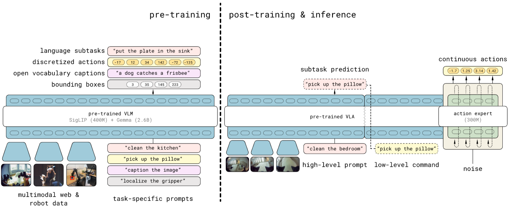

Paper: [Black et al. (2025), arXiv:2504.16054v1](https://arxiv.org/abs/2504.16054v1).
This note follows the paper's two-stage recipe and inference procedure.

## Problem

Tidying an unfamiliar kitchen requires choosing useful subtasks and executing them with the robot's body.
The model must recognize objects and situations beyond the robot demonstrations while still producing precise continuous actions.
π0.5 studies whether heterogeneous robot and vision-language training can support this generalization to new homes.

Its output has two levels: a language subtask $\hat\ell$, such as “pick up the plate,” and a continuous action chunk $A$ conditioned on that subtask.
Let $o=(I,q)$ contain camera observations and robot state, and let $\ell$ be the overall user instruction.
The paper factors the policy as

$$
    \begin{aligned}
        &\pi(A,\hat\ell\mid o,\ell)\\
        &\quad=\pi(A\mid o,\hat\ell)
        \pi(\hat\ell\mid o,\ell).
    \end{aligned}
$$

The low-level factor receives the selected subtask as its command. [Paper, Section IV-A](https://arxiv.org/pdf/2504.16054v1#page=5).

## Previous Attempts

[π0](pi0.qmd) combines a pretrained VLM with continuous flow-based action generation.
[FAST](fast.qmd) represents action chunks as compact discrete sequences suitable for next-token prediction.
π0.5 uses both representations at different stages and combines robot control data with semantic supervision from other sources.
The motivation is that efficient representation learning and efficient low-level action generation need not use identical output formats. [Paper, Sections III–IV-B](https://arxiv.org/pdf/2504.16054v1#page=4).

## Proposed Solution

**Pretraining teaches the backbone through discrete outputs.**
The starting point is a pretrained PaliGemma VLM, including its vision encoder and language backbone.
The first robot-learning stage uses next-token prediction on FAST actions, language, and localization outputs.
Its data mixture includes mobile robots in diverse environments, other robot embodiments, annotated high-level subtasks, and web vision-language data.
At this stage the continuous action expert has not yet been added. [Paper, Sections IV-B–C](https://arxiv.org/pdf/2504.16054v1#page=6).

{#fig-pi05-recipe fig-alt="Pi0.5 diagram separating discrete-token pretraining from post-training with a smaller action expert and predicted language subtasks" width="100%"}

**Post-training adds the continuous expert while retaining token prediction.**
The new action expert starts from random weights and learns flow matching alongside the existing next-token objective.
The post-training mixture focuses on successful, efficient mobile and multi-environment robot episodes, retains relevant semantic and web data, and adds verbal instruction demonstrations.
These verbal examples teach which high-level commands help the trained low-level policy make progress. [Paper, Section IV-D](https://arxiv.org/pdf/2504.16054v1#page=7).

The data labels describe different sources of supervision, rather than separate model modules:

| Data group | What it contributes |
|---|---|
| Mobile manipulation (MM) | Embodied trajectories in diverse homes. |
| Multi-environment non-mobile robots (ME) | Manipulation experience across settings. |
| Cross-embodiment data (CE) | Other robot bodies and laboratory tasks. |
| High-level supervision (HL) | Language descriptions of useful subtasks. |
| Web data (WD) | Visual-semantic tasks such as localisation and question answering. |
| Verbal instruction data (VI) | Stepwise human instructions added during post-training. |

Co-training means that these heterogeneous examples contribute their available targets to a shared training recipe; it does not require every example to contain every modality or supervision type. [§§IV-C–D](https://arxiv.org/pdf/2504.16054v1#page=6).

The combined objective is

$$
    \mathcal{L}
    =\mathcal{L}_{\mathrm{tokens}}
    +\alpha\mathcal{L}_{\mathrm{flow}}.
$$

The paper uses $\alpha=0$ during discrete pretraining and $\alpha=10$ after adding the action expert.
Token targets include FAST actions as well as other output text; continuous robot examples additionally supervise the flow output.
Only designated output positions carry prediction losses. [Paper, Equation (1) and Section IV-D](https://arxiv.org/pdf/2504.16054v1#page=5).

::: {.callout-note collapse="true" icon="false" title="Derivation: two targets from one demonstrated chunk"}
Take a normalized demonstrated chunk $A$ and its observation condition $c$.
The discrete representation is $z=T_{\mathrm{FAST}}(A)$, and teacher-forced next-token training uses

$$
    \mathcal{L}_{\mathrm{FAST}}
    =-\sum_j\log p_\theta(z_j\mid c,z_{<j}).
$$

For the continuous representation, sample noise $\epsilon$ and time $\tau$, using noise at zero and data at one:

$$
    \begin{aligned}
        A^\tau&=(1-\tau)\epsilon+\tau A,\\
        u&=A-\epsilon,\\
        \mathcal{L}_{\mathrm{flow}}
        &=\mathbb{E}\|v_\theta(A^\tau,c,\tau)-u\|^2.
    \end{aligned}
$$

These losses train different representations of the same demonstrated behavior.
The continuous branch cannot read the FAST targets; otherwise it could use a representation of the answer during training that is absent during flow inference.
Section IV-B, page 5, prints the opposite velocity sign beside the noise-to-data interpolation; this note uses its explicit derivative, as explained in the [π0 convention note](pi0.qmd). [Paper, Section IV-B and Appendix E](https://arxiv.org/pdf/2504.16054v1#page=19).
:::

**State moves into the backbone prefix.**
In original π0, the real-valued state vector is projected into one action-expert token.
In π0.5, state is discretized and represented as text tokens beside the images and instruction in the VLM prefix.
This makes state available while the backbone itself learns to predict discrete robot actions, including before the continuous expert exists.
That is an architectural reason for the placement, rather than evidence that text is intrinsically the best state representation. [Paper, Section IV-A and Appendix E](https://arxiv.org/pdf/2504.16054v1#page=19).

The paper does not specify a universal literal prompt string or state-bin count in these sections.
Likewise, one state coordinate need not occupy one language token: token counts depend on the representation and tokenizer.
Keep state discretization, language tokenization, and FAST action tokenization conceptually separate.

**The two streams interact at corresponding transformer layers.**
The backbone and expert have distinct weights and hidden widths, with compatible attention dimensions.
The prefix contains images, instruction, and state; FAST outputs use the backbone, while continuous noisy actions use the expert.
The permitted attention reads are:

| Query block | Can attend to |
|---|---|
| Prefix | All prefix tokens |
| FAST actions | Prefix and preceding FAST tokens |
| Continuous actions | Prefix and all continuous actions |

The expert's action queries come from its own action hidden states, and they read prefix keys and values carrying image, language, and state information.
The image or state tokens do not supply one shared query for the whole action sequence. [Paper, Appendix E and Figure 18](https://arxiv.org/pdf/2504.16054v1#page=19).

Flow time is encoded separately and injected through adaptive RMSNorm at each expert layer, while noisy actions enter through a linear projection.
This differs from π0's input-level fusion of action and time embeddings.
The observation remains clean conditioning information throughout flow generation.

**Inference generates a subtask, then a continuous chunk.**
The model first decodes the high-level language output autoregressively.
It then conditions the action expert on the selected subtask and current observation, starting from Gaussian action noise and using ten flow-integration steps.
FAST token decoding is useful for training the representation but is not required for the paper's final low-level controller. [Paper, Figure 3 and Section IV-B](https://arxiv.org/pdf/2504.16054v1#page=4).

Localization tokens and bounding boxes appear in training tasks.
Their presence does not imply that every control inference must output a coordinate-token plan before acting.
The documented low-level outputs are continuous targets for the arms, grippers, torso, and base, tracked by the robot's controllers. [Paper, Sections IV-C–E](https://arxiv.org/pdf/2504.16054v1#page=7).

## Evidence

The experiments evaluate previously unseen homes and ablate training data, model choices, and high-level inference.
The results support combining heterogeneous data and learned subtask selection in this setting; the benefit varies across tasks. [Paper, Section V and Appendix D](https://arxiv.org/pdf/2504.16054v1#page=8).
They do not establish that discrete actions are universally superior controllers or isolate state tokenization as the sole cause of improved generalization.

## Limitations

The evaluated household tasks and available robot data bound the evidence for open-world generalization.
The paper's attention mask restricts forward reads between branches, but it does not specify the stop-gradient rule from the separate [knowledge-insulation paper](knowledge-insulation.qmd).
Those mechanisms should remain distinct when reproducing a training recipe.

## Connections

[Representations](../../study-notes/machine-learning/representations.qmd) explains continuous embeddings and discrete token IDs; [attention](../../study-notes/machine-learning/attention.qmd#projections) explains how state reaches action positions.
[Cross-entropy](../../study-notes/mathematics/entropy.qmd#cross-entropy) describes the token loss, and [generative action models](../../study-notes/machine-learning/generative-models.qmd#questions) develops the flow loss.
[Knowledge insulation](knowledge-insulation.qmd) adds explicit control of which loss updates the backbone, while [IRTC](irtc.qmd) studies execution continuity after chunk generation.
[π*0.6](pi06.qmd) extends this model family with training from autonomous outcomes and human corrections.
