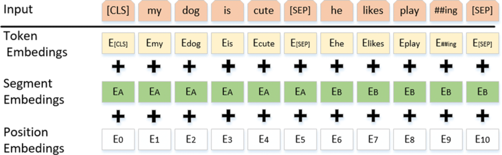

Paper: [Devlin et al. (2018), BERT: Pre-training of Deep Bidirectional Transformers for Language Understanding](https://arxiv.org/abs/1810.04805).

## Problem

The meaning of a word can depend on text both before and after it.
BERT pretrains a transformer encoder whose token representations can incorporate both directions, then adapts those representations to downstream language tasks.

## Previous Attempts

A left-to-right language model predicts the next token from preceding tokens.
If a fully bidirectional model were trained to predict each unchanged input token directly, it could read the answer at that position.
BERT therefore corrupts selected input positions and predicts their original tokens. [Sections 1 and 3](https://arxiv.org/pdf/1810.04805#page=2).

## Proposed Solution

An input position receives the sum of a token embedding, a segment embedding, and a position embedding.
The special `[CLS]` token starts the sequence, and `[SEP]` separates segments and marks their endings.
Segment embeddings distinguish the two input segments; `[CLS]` supplies the representation used by the original next-sentence classifier and many sequence-level task heads. [Section 3 and Figure 2](https://arxiv.org/pdf/1810.04805#page=3).

{width="100%" fig-alt="BERT input sequence with CLS and SEP tokens and three embedding rows added position by position"}

**Masked language modeling selects 15% of token positions for prediction.**
Among selected positions, 80% are replaced with `[MASK]`, 10% with a random token, and 10% remain unchanged.
The target is always the original token, and this loss is evaluated only at the selected positions.
Thus, selecting 15% does not mean that 15% of the sequence visibly contains `[MASK]`. [Section 3.1](https://arxiv.org/pdf/1810.04805#page=4).

**Next-sentence prediction is a separate binary task.**
Half the training segment pairs use the actual following segment; the other half replace it with a randomly sampled segment.
The model predicts this label from `[CLS]`.
The pretraining objective combines this classification loss with the selected-token prediction loss. [Section 3.1](https://arxiv.org/pdf/1810.04805#page=4).

## Evidence and Limitations

The paper fine-tunes the pretrained model with task-specific outputs and evaluates language understanding and question answering benchmarks.
Its ablations examine the original bidirectional and next-sentence pretraining choices. [Sections 4–5](https://arxiv.org/pdf/1810.04805#page=5).
These results concern the original recipe; they do not establish that every later language model needs next-sentence prediction.
BERT's default encoder is not a causal next-token generator, and `[CLS]` is a learned task representation rather than an automatic summary of every possible property of the text.

## Connections

The [attention note](../../study-notes/machine-learning/attention.qmd#generation-order) distinguishes bidirectional reads from causal generation.
The [representation note](../../study-notes/machine-learning/representations.qmd#sentencepiece) distinguishes tokenizer algorithms, token IDs, and embedding vectors.
[PaliGemma](paligemma.qmd) combines a bidirectional image-and-prompt prefix with a causally generated output suffix.
