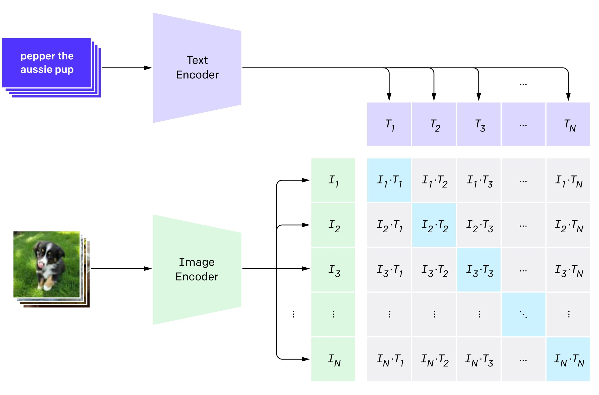

Paper: [Radford et al. (2021), Learning Transferable Visual Models From Natural Language Supervision](https://arxiv.org/abs/2103.00020).

## Problem

A classifier trained with a fixed list of labels cannot directly accept a new category description at inference.
CLIP learns a shared space for images and text so that natural-language descriptions can specify recognition tasks.
Its supervision consists of paired images and text, rather than only manually assigned class IDs.

## Previous Attempts

Caption prediction trains a model to generate an image's description token by token.
CLIP instead asks which text in a batch belongs with each image, and which image belongs with each text.
The paper compares these objectives and motivates contrastive matching through its observed training efficiency. [Section 2.3 and Figure 2](https://arxiv.org/pdf/2103.00020#page=4).

## Proposed Solution

An image encoder and a text encoder produce vectors that separate learned linear projections map into a common dimensional space.
L2 normalization makes their dot product a cosine similarity.
For a batch of $N$ matched pairs, the score matrix has one row per image and one column per text:

$$
    \begin{aligned}
        u_i&=\frac{W_I f(I_i)}{\|W_I f(I_i)\|_2},\\
        v_j&=\frac{W_T g(T_j)}{\|W_T g(T_j)\|_2},\\
        s_{ij}&=u_i^\top v_j/T.
    \end{aligned}
$$

Here $T>0$ is a learned temperature, and the paired target for row or column $i$ is its diagonal entry.
These are shared-space embedding projections, distinct from the $Q,K,V$ projections inside [attention](../../study-notes/machine-learning/attention.qmd#projections).

The training objective averages image-to-text and text-to-image cross-entropy, with each matched pair as the correct row and column target:

$$
    L=\tfrac12(L_{I\to T}+L_{T\to I}).
$$

{width="100%" fig-alt="A batch of image and text embeddings forms a similarity matrix with matched pairs on its diagonal"}

::: {.callout-note collapse="true" icon="false" title="Derivation: why both rows and columns use cross-entropy"}
For image $i$, a softmax across its row gives the probability assigned to text $j$ among the batch candidates.
For text $i$, a softmax down its column gives the probability assigned to image $j$.

$$
    \begin{aligned}
        L_{I\to T}&=-\frac1N\sum_i
        \log\frac{e^{s_{ii}}}{\sum_j e^{s_{ij}}},\\
        L_{T\to I}&=-\frac1N\sum_i
        \log\frac{e^{s_{ii}}}{\sum_j e^{s_{ji}}}.
    \end{aligned}
$$

Every off-diagonal pair acts as a negative for this objective, even when two descriptions happen to fit the same image.
The contrastive labels therefore specify observed pairing, not a complete semantic truth table.
See the paper's [Figure 3 pseudocode](https://arxiv.org/pdf/2103.00020#page=5) and the study note on [cross-entropy](../../study-notes/mathematics/entropy.qmd#cross-entropy).
:::

The paper trains both encoders from scratch on WIT, a collected dataset of 400 million image–text pairs.
Its models include modified ResNets and [ViTs](../vision/vit.qmd), specifically ViT-B/32, ViT-B/16, and ViT-L/14, with an additional higher-resolution L/14 variant.
The text encoder is a transformer; the original training recipe uses large batches, Adam with decoupled weight decay, cosine learning-rate decay, and 32 epochs. [Sections 2.2–2.5](https://arxiv.org/pdf/2103.00020#page=3).

## Zero-shot Classification

To classify a photograph as a dog or a cat, encode prompts such as “a photo of a dog” and “a photo of a cat.”
Their normalized text vectors act as classifier weights: compare the image vector with each and normalize the scores across the chosen categories.
This requires no labeled examples from that downstream classification task.
It does require candidate descriptions, and it does not make CLIP a caption generator.

Prompt wording matters because a bare label can be ambiguous or unlike the text seen during training.
Prompt ensembling averages text embeddings from several templates for each class and normalizes the resulting class vector.
A linear probe instead learns a classifier from labeled downstream examples while freezing the image representation.
These protocols measure different forms of transfer; a fitted linear probe is not a guaranteed upper bound on every zero-shot result. [Sections 3.1–3.2](https://arxiv.org/pdf/2103.00020#page=6).

## Evidence and Limitations

The paper evaluates zero-shot and linear-probe transfer across many recognition datasets and studies distribution shifts.
Its human comparison concerns a particular Oxford-IIIT Pets classification experiment, so it does not establish general superiority to human vision. [Sections 3–4](https://arxiv.org/pdf/2103.00020#page=7).
The overlap analysis compares performance on detected overlapping and clean subsets; it is evidence about the measured overlaps, not proof that every contamination channel is absent. [Section 5](https://arxiv.org/pdf/2103.00020#page=18).

Performance remains sensitive to domain, task, candidate labels, and prompt choice.
Fine-grained specialized recognition, some abstract tasks, and dataset biases remain limitations.
Similarity scores are relative to the chosen candidate set and should not automatically be interpreted as calibrated real-world probabilities. [Sections 6–7](https://arxiv.org/pdf/2103.00020#page=20).

## Connections

[DINO](../vision/dino.qmd) learns visual features without paired text, whereas CLIP's cross-modal supervision supports description-based retrieval and classification.
[PaliGemma](paligemma.qmd) starts with a SigLIP image encoder and adds a generative language model.
The [representation note](../../study-notes/machine-learning/representation-learning.qmd#clip-and-siglip) compares CLIP's batch softmax with SigLIP's pairwise sigmoid loss.
