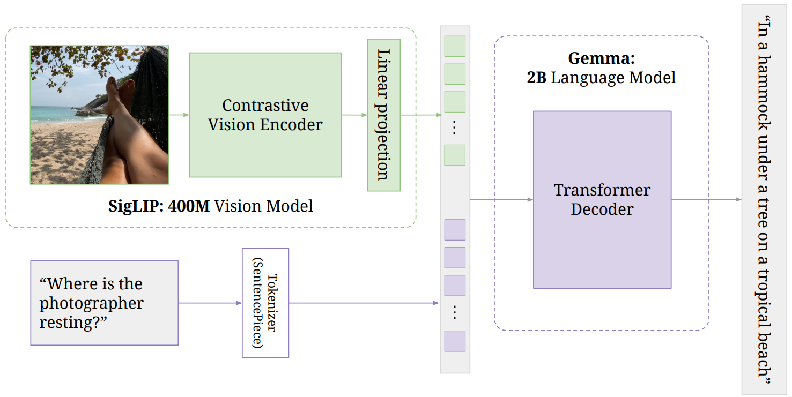

Paper: [Beyer et al. (2024), PaliGemma: A versatile 3B VLM for transfer](https://arxiv.org/abs/2407.07726v1).
This note concerns the original PaliGemma model.

## Problem

A visual representation can support recognition without being able to answer a question in language.
PaliGemma combines image features with a language model so that a task prompt specifies the requested output.

## Previous Attempts

[CLIP](clip.qmd) compares image and text embeddings to recognize or retrieve matching content.
Generative VLMs instead condition a language model on visual information and train it to produce an answer.
PaliGemma adopts that generative interface with existing SigLIP and Gemma components. [Sections 2–3](https://arxiv.org/html/2407.07726v1#S3).

## Proposed Solution

The image encoder is SigLIP's ViT-So400m, the language model is Gemma-2B v1, and a learned linear projection matches their hidden dimensions.
Image features become continuous vectors in the input sequence.
Text instead passes through Gemma's tokenizer and vocabulary embedding lookup. [Section 3.1](https://arxiv.org/html/2407.07726v1#S3.SS1).

{width="100%" fig-alt="SigLIP image encoder connected by a linear projection to a Gemma language model processing an image and text prompt"}

The language-model input contains image tokens, a beginning-of-text marker, the prompt, a separator, and the target or generated suffix.
Image and prompt tokens can attend bidirectionally within their prefix.
Suffix tokens attend to that prefix and earlier suffix positions under a causal mask. [Section 3.1 and Figure 2](https://arxiv.org/html/2407.07726v1#S3.SS1).

## Keep the Objectives Separate

SigLIP's original image–text pretraining uses a sigmoid loss on matching and nonmatching pairs.
PaliGemma's multimodal training predicts output tokens conditioned on images and a prompt.
Reusing the SigLIP encoder does not mean that every PaliGemma update optimizes SigLIP's original pairwise objective. [Sections 3.1–3.2](https://arxiv.org/html/2407.07726v1#S3.SS2).

For an output sequence $y=(y_1,\ldots,y_M)$ and conditioning input $c$, the generative factorization is

$$
    p_\theta(y\mid c)=\prod_{t=1}^{M}
    p_\theta(y_t\mid c,y_{<t}).
$$

The corresponding token prediction objective sums the negative log-probabilities of target suffix tokens.
During teacher-forced training, earlier target tokens are available as inputs under the causal mask.
During generation, earlier generated tokens take their place.
The [cross-entropy note](../../study-notes/mathematics/entropy.qmd#cross-entropy) explains this objective, while the [representation note](../../study-notes/machine-learning/representation-learning.qmd#clip-and-siglip) develops the sigmoid comparison.

The paper distinguishes existing component pretraining, multimodal pretraining with all components trainable, continued training at higher resolution, and task-specific transfer.
The base model is intended for transfer, and its output vocabulary also supports specified detection and segmentation representations. [Sections 3.2–4](https://arxiv.org/html/2407.07726v1#S3.SS2).

## Supporting Concepts

**Softmax and sigmoid answer different normalization questions.**
A row softmax makes candidates compete within that row, whereas independent sigmoid outputs are not constrained to sum to one.
This does not make the underlying events or learned representations statistically independent.

::: {.callout-note collapse="true" icon="false" title="Derivation: subtracting the maximum leaves softmax unchanged"}
For logits $a_1,\ldots,a_K$ and any shared scalar $m$,

$$
    \frac{e^{a_i-m}}{\sum_j e^{a_j-m}}
    =\frac{e^{a_i}}{\sum_j e^{a_j}}.
$$

Choosing $m=\max_j a_j$ avoids exponentiating large positive numbers.
For a matrix, the maximum must be taken along the same axis as that softmax; a column normalization answers a different candidate-selection question.
:::

**Normalization, tokenization, and caching are separate operations.**
[Activation normalization](../../study-notes/machine-learning/normalization.qmd#what-to-check-when-reading-a-model) changes hidden-vector statistics.
[SentencePiece tokenization](../../study-notes/machine-learning/representations.qmd#sentencepiece) converts text into pieces and IDs; the framework supports multiple algorithms.
[Attention and KV caching](../../study-notes/machine-learning/attention.qmd#projections) explain how fixed prefix computations can be reused during causal decoding.
Caching stores previous keys and values at each layer; it does not remove the query–key softmax needed to read them.

## Evidence and Limitations

The paper evaluates transfer across captioning, visual question answering, and structured visual tasks. [Section 4](https://arxiv.org/html/2407.07726v1#S4).
This note records the architecture and objective distinctions; it does not establish the behavior of every downstream checkpoint.
For a concrete output such as bounding boxes, the task's serialization and decoding rules must be specified before interpreting generated tokens as coordinates.

## Connections

[π0](../action/pi0.qmd) uses a pretrained PaliGemma backbone together with a new continuous action expert.
[π0.5](../action/pi05.qmd) further separates high-level language prediction from low-level action generation.
Those robot architectures add state representations, masks, objectives, and action outputs that should not be inferred from PaliGemma's image–text interface alone.
