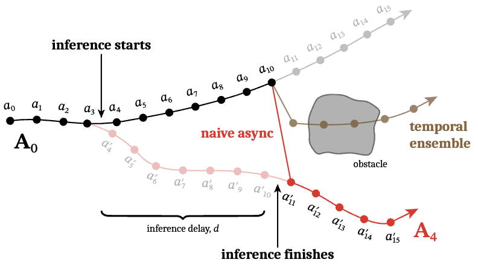
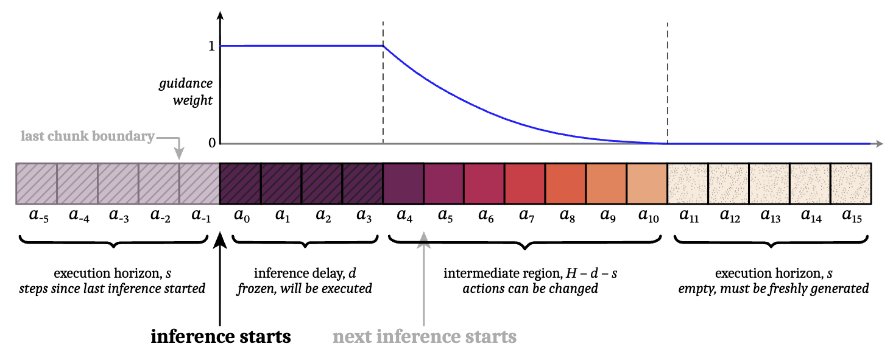

Paper: [arXiv:2506.07339](https://arxiv.org/abs/2506.07339)

## Problem

With a VLM, the user can usually wait for an answer.
A robot does not have that luxury: while its VLA is computing the next action, the physical world keeps moving.
Large models can take longer to run than a single controller step, so simply waiting for every new prediction can make the robot pause between action chunks.

So the next chunk has to be generated asynchronously.
While the robot executes the current chunk, the policy generates the next one in the background.
The catch is that robot actions are often multimodal: there may be several valid ways to complete the same task.
This is useful, but it creates a problem at chunk boundaries.
Two consecutive chunks can choose different modes even when each chunk is valid on its own.
This is **mode switching between chunks**, not mode collapse.

## Previous Attempts

Two common approaches can hide the inference delay, but neither fully solves this continuity problem.
Suppose there is an obstacle in the middle of a table and a ball behind it.
The robot can approach the ball from the left or the right, but it cannot safely go through the middle.

- **Naive asynchronous execution**
  The policy generates a new chunk while the old one is being executed, then switches to the new chunk as soon as it is ready.
  This can work when both chunks choose the same strategy.
  If the old chunk goes left and the new chunk goes right, however, switching directly between them creates a sudden jump in position or velocity.
  Such a jump can be out of distribution for the controller and dangerous for the robot.

- **Temporal ensemble**
  Temporal ensemble comes from [Learning Fine-Grained Bimanual Manipulation with Low-Cost Hardware](https://arxiv.org/pdf/2304.13705).
  The policy repeatedly predicts overlapping action chunks, and the actions proposed for the same controller timestep are combined through a weighted average.
  This smooths the jump, but an average of valid actions is not necessarily a valid action.
  If one chunk goes left and another goes right, their average may send the robot straight toward the obstacle.

{#fig-2 fig-alt="A timeline of two action chunks choosing different paths around an obstacle; naive asynchronous execution jumps between the chunks while temporal ensemble averages them into a path through the obstacle" width="95%"}

## Proposed Solution

The paper calls the method real-time chunking (RTC).
Here, I use **inference-time real-time chunking (IRTC)** for this method, leaving TRTC available for the related paper later.
IRTC changes how a pretrained flow or diffusion policy generates actions, but it does not retrain the policy or change its parameters.

Let the old action chunk contain $H$ actions, and let $s$ be the execution horizon: the number of its actions that have already been consumed when inference for the next chunk starts.
If one controller step lasts $\Delta t$ and inference takes $\delta$ seconds, the inference delay measured in controller steps is

$$
    d = \left\lfloor \frac{\delta}{\Delta t} \right\rfloor.
$$

The robot continues executing the old chunk during those $d$ steps.
Therefore, the first $d$ positions of the new chunk correspond to actions that the old chunk will have executed before the new chunk is ready.
IRTC treats this prefix as frozen:

$$
    \mathbf{A}_{\text{new}}[0:d]
    \approx
    \mathbf{A}_{\text{old}}[s:s+d].
$$

This only works if the old chunk still contains enough actions to cover the delay:

$$
    d \leq H-s.
$$

The word *frozen* can be slightly misleading.
IRTC does not first generate a complete trajectory and then overwrite its beginning.
Instead, it guides every flow-integration step so that the final chunk grows around the actions that are already committed.

{#fig-irtc-soft-mask fig-alt="The old chunk and new chunk overlap across a frozen region and a softly guided region before reaching a free future region" width="100%"}

Start with ordinary flow matching.
Let each action have dimension $M$, so an action chunk is $\mathbf{A}_t \in \mathbb{R}^{H\times M}$.
The policy begins with Gaussian noise:

$$
    \mathbf{A}_t^0 \sim \mathcal{N}(\mathbf{0},\mathbf{I}).
$$

It then predicts a velocity $\mathbf{v}_{\pi}(\mathbf{A}_t^\tau,\mathbf{o}_t,\tau)$ from the current noisy chunk, the observation $\mathbf{o}_t$, and flow time $\tau$.
With $n$ integration steps, the usual Euler update is

$$
    \mathbf{A}_t^{\tau+\frac{1}{n}}
    =
    \mathbf{A}_t^\tau
    +
    \frac{1}{n}
    \mathbf{v}_{\pi}(\mathbf{A}_t^\tau,\mathbf{o}_t,\tau).
$$

Repeating this update moves the sample from noise at $\tau=0$ toward a clean action chunk at $\tau=1$.

At an intermediate flow time, the current sample is not clean yet.
IRTC estimates its endpoint by extrapolating the current velocity:

$$
    \widehat{\mathbf{A}_t^1}
    =
    \mathbf{A}_t^\tau
    +
    (1-\tau)
    \mathbf{v}_{\pi}(\mathbf{A}_t^\tau,\mathbf{o}_t,\tau).
$$

The target comes from the previous chunk.
The slice $\mathbf{A}_{\text{old}}[s:H]$ contains the $H-s$ actions that remained when the new inference call began.
IRTC places those actions at the front and pads the final $s$ positions with zeros:

$$
    \mathbf{Y}
    =
    \left[
    \underbrace{\mathbf{A}_{\text{old}}[s:H]}_{H-s\text{ overlapping actions}},
    \underbrace{\mathbf{0},\ldots,\mathbf{0}}_{s\text{ padding actions}}
    \right].
$$

The zeros are only placeholders.
Their weights will be zero, so IRTC does not actually try to make the new future actions equal to zero.

To make the dimensions explicit, flatten each $H\times M$ action chunk into a vector in $\mathbb{R}^{HM}$.
Let $\mathbf{w}$ contain one soft-mask weight per timestep, repeated across the $M$ dimensions of the corresponding action, and define the diagonal weight matrix $\mathbf{W}=\operatorname{diag}(\mathbf{w})$.
The consistency loss is

$$
    \mathcal{L}(\mathbf{A}_t^\tau)
    =
    \frac{1}{2}
    \left\|
    \mathbf{W}^{1/2}
    \left(
    \widehat{\mathbf{A}_t^1}(\mathbf{A}_t^\tau)-\mathbf{Y}
    \right)
    \right\|_2^2.
$$

Because all mask weights are nonnegative, $\mathbf{W}^{1/2}$ is simply the diagonal matrix containing their square roots.
If the old chunk is committed to going left but the estimated endpoint goes right, this loss becomes large.
IRTC then computes the negative-gradient direction, which reduces the mismatch:

$$
    \mathbf{g}_\tau
    =
    -\nabla_{\mathbf{A}_t^\tau}
    \mathcal{L}(\mathbf{A}_t^\tau)
    =
    \left(\frac{\partial\widehat{\mathbf{A}_t^1}}
    {\partial\mathbf{A}_t^\tau}\right)^{\!\top}
    \mathbf{W}
    \left(\mathbf{Y}-\widehat{\mathbf{A}_t^1}\right).
$$

This vector–Jacobian product is computed by backpropagation.
It tells us how to nudge the current noisy chunk so that its estimated clean endpoint agrees better with the old trajectory.

The paper builds on pseudoinverse guidance ($\Pi$GDM).
Its guided velocity can be written as

$$
    \begin{aligned}
        \mathbf{v}_{\Pi\mathrm{GDM}}
        (\mathbf{A}_t^\tau,\mathbf{o}_t,\tau)
        &=
        \mathbf{v}_{\pi}
        (\mathbf{A}_t^\tau,\mathbf{o}_t,\tau)
        +
        \alpha_\tau\mathbf{g}_\tau,\\[4pt]
        \alpha_\tau
        &=
        \min\!\left(
        \beta,
        \frac{1-\tau}{\tau r_\tau^2}
        \right),
        \qquad
        r_\tau^2
        =
        \frac{(1-\tau)^2}{\tau^2+(1-\tau)^2}.
    \end{aligned}
$$

Here, $\beta$ clips the guidance strength.
At $\tau=0$, $\alpha_0$ is defined as the clipped limiting value $\beta$; without clipping, the scale would be unbounded.
Large guidance weights can make generation unstable, especially when the controller uses only a few flow steps.
After computing this guided velocity, IRTC performs the usual integration update and repeats the process at the next flow step.

Hard inpainting would constrain only the first $d$ actions.
IRTC instead uses all $H-s$ actions that overlap with the old chunk, but trusts actions less as they extend further into the future.
The paper defines the timestep weights as

$$
    w_i
    =
    \begin{cases}
        1,
        & i<d,\\[4pt]
        c_i\dfrac{e^{c_i}-1}{e-1},
        & d\leq i<H-s,\\[8pt]
        0,
        & i\geq H-s,
    \end{cases}
    \qquad
    c_i
    =
    \frac{H-s-i}{H-s-d+1},
    \qquad
    i\in\{0,\ldots,H-1\}.
$$

The mask has three regions: **frozen, revisable, and free**.
The first $d$ actions get full weight because they will be executed before inference finishes.
The intermediate actions get a decaying weight, so the new chunk follows the old strategy without being forced to copy it exactly.
The final $s$ actions do not overlap with the old chunk, so their weight is zero and the model generates them freely from the latest observation.

During flow integration, $\mathbf{A}_t^\tau$ and $\widehat{\mathbf{A}_t^1}$ are only internal numerical states; the robot never executes them.
Only the completed chunk $\mathbf{A}_t^1$ becomes available to the controller.
An intermediate sample therefore does not need to be a physically valid trajectory by itself.
The final chunk still has to stay near the policy's learned action distribution and remain compatible with the actions already in motion.

## Limitations

IRTC hides latency by overlapping inference with execution; it does not make the base model faster.
The paper states two main limitations: backpropagation adds computational overhead, and the method only applies to diffusion- and flow-based policies.

A few practical failure cases are also easy to imagine:

- the guidance strength is too large;
- the target actions conflict with the current observation;
- the committed prefix is incompatible with any trajectory learned by the model;
- there are too few integration steps for accurate guidance; or
- the model's velocity field is inaccurate.

The clipping value $\beta$ helps with the first problem, but it cannot remove the basic trade-off.
IRTC has to preserve continuity with the old chunk without stopping the policy from reacting to new information.
