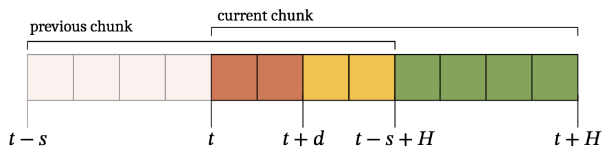
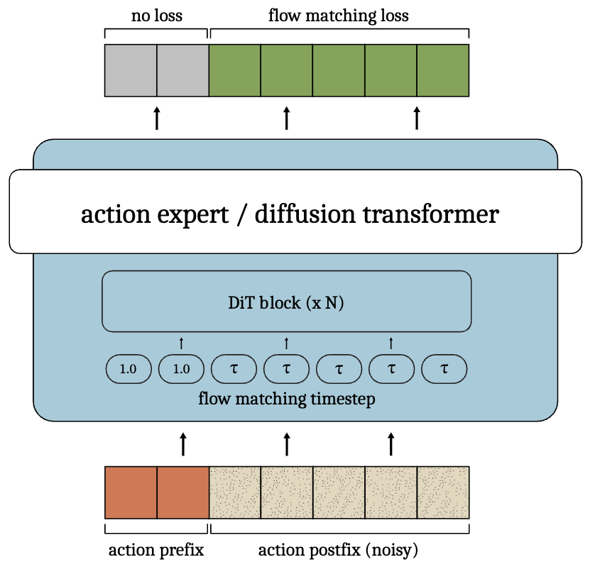

Paper: [arXiv:2512.05964](https://arxiv.org/abs/2512.05964v2)

## Problem

IRTC makes action chunks continuous by guiding every flow-matching step at inference time.
The problem is that this guidance requires an extra vector–Jacobian product, or in simpler terms, an extra backward pass at every step.
That increases the computation cost and delays inference, which is somewhat counterintuitive for a method meant to make robot control run in real time.

The effect becomes more noticeable when the inference delay is long.
Then IRTC has to keep a larger part of the new chunk consistent with the previous chunk, so the inpainting problem gets harder as well as more expensive.

## Previous Attempt

Let the prediction horizon be $H$, the execution horizon be $s$, and the inference delay be $d$ controller steps.
While the current chunk is being generated, the robot keeps executing the previous chunk.
By the time the new chunk is ready at $t+d$, its first $d$ actions have already been covered by the previous chunk.
These overlapping actions become the action prefix, so the setup requires $d \leq H-s$.

{#fig-1 fig-alt="A timeline of two overlapping action chunks, with the first d actions of the current chunk marked as the action prefix" width="100%"}

IRTC uses this known prefix as a hard constraint and also softly guides the remaining overlap.
That soft masking is flexible, but it is also where the inference-time overhead comes from.

## Proposed Solution

TRTC moves the conditioning work from inference time to training time.
I will call it TRTC here to keep the training-time method separate from IRTC.

Normally, a flow policy starts with Gaussian noise for the whole action chunk and gradually updates it at each flow-matching step.
TRTC instead divides the training chunk into a clean action prefix and a noisy action postfix.
The prefix comes directly from the ground-truth action chunk, while the postfix is trained in the usual flow-matching way.

The prefix is already at its target value, so its flow-matching timestep is set to $\tau=1$.
It does not need to be updated, and the loss is masked out over this region.
The model only receives the flow-matching loss on the noisy postfix.

{#fig-2 fig-alt="A diffusion transformer receives a clean action prefix with timestep one and a noisy postfix with timestep tau; the loss is applied only to the postfix" width="80%"}

During training, the delay $d$ is sampled rather than fixed.
This lets the model practise continuing from prefixes of different lengths, since the real inference delay may change from one run to another.

At inference time, the ground-truth prefix is of course unavailable.
Instead, the model takes the already committed actions from the previous chunk as the clean prefix and generates only the remaining postfix.
There is no extra inference-time loss, pseudoinverse guidance, or backward pass.

So the basic trade is simple.
IRTC solves continuity during inference, whereas TRTC teaches the model how to continue a known prefix during training.

## Limitations

TRTC is less flexible than IRTC because it only supports a hard prefix.
It cannot softly use the additional overlapping actions beyond that prefix in the same way IRTC can.

It also needs a sensible distribution of delays during training.
If the delays seen on the robot are very different from the delays used for training, the model may not have learned the right prefix lengths well enough.

Finally, TRTC requires training or fine-tuning with action-prefix conditioning.
IRTC can instead be applied to an existing flow policy at inference time, although it pays for that flexibility with extra computation.
