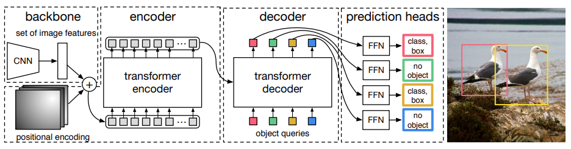

Paper: [Carion et al. (2020), End-to-End Object Detection with Transformers](https://arxiv.org/abs/2005.12872).
This note covers original DETR.

## Problem

An image's objects form an unordered set.
Most earlier detectors produce many candidate boxes and then suppress redundant detections.
DETR learns a fixed collection of prediction slots and assigns ground-truth objects to those slots one-to-one during training.

## Previous Attempts

[Faster R-CNN](faster-r-cnn.qmd) and [SSD](ssd.qmd) use anchors or default boxes, overlap-based target assignment, and non-maximum suppression.
DETR replaces these components with learned queries and a set prediction objective. [Sections 1–3](https://arxiv.org/pdf/2005.12872#page=2).

## Proposed Solution

A CNN converts the image into a spatial feature map.
After a channel projection and flattening of spatial positions, a transformer encoder processes the feature sequence with positional information.
These positions represent CNN features, not individual raw pixels.
A transformer decoder uses learned **object queries** to identify a fixed number of output slots.
Its self-attention relates slots to one another, and cross-attention reads the encoded image features.
Shared prediction heads produce a class distribution and a normalized bounding box for every slot. [Section 3.2 and Figure 2](https://arxiv.org/pdf/2005.12872#page=6).

{width="100%" fig-alt="CNN image features enter a transformer encoder and learned object queries drive parallel decoder predictions"}

The decoder updates all slots in parallel rather than generating object one, then object two, in a causal sequence.
A slot can predict the special no-object class when it is unused.
Its learned query identifies a prediction position; it is not a ground-truth object label supplied at inference.

## One-to-One Target Assignment

Let there be $N$ predicted slots and pad the target set to size $N$ with no-object entries.
The Hungarian algorithm finds the minimum-cost one-to-one assignment:

$$
    \hat\sigma=\arg\min_{\sigma}
    \sum_{i=1}^N C(y_i,\hat y_{\sigma(i)}).
$$

For a real target object $i$ and prediction $j$, the paper's matching cost combines the negative predicted class probability with a box cost:

$$
    C_{ij}=-\hat p_j(c_i)
    +L_{\mathrm{box}}(b_i,\hat b_j).
$$

The no-object entries contribute zero to this matching cost.
Notice the use of $-\hat p_j(c_i)$, not $-\log\hat p_j(c_i)$, in the paper's assignment equation. [Section 3.1, Equation 1](https://arxiv.org/pdf/2005.12872#page=5).

## Loss after Assignment

Once the assignment is chosen, each slot receives the class target assigned to it.
The class training loss is negative log-likelihood, including the no-object class:

$$
    L_{\mathrm{cls}}=-\sum_i
    w_i\log\hat p_{\hat\sigma(i)}(c_i).
$$

Here $w_i$ downweights no-object targets, using 0.1 in the original recipe.
Only real objects contribute box loss, which combines coordinate L1 error with generalized-IoU loss:

$$
    \begin{aligned}
        L_{\mathrm{box}}(b,\hat b)
        &=\lambda_1\|b-\hat b\|_1\\
        &\quad+\lambda_G L_{\mathrm{GIoU}}(b,\hat b).
    \end{aligned}
$$

The total training loss adds classification and the assigned foreground box losses.
Assignment cost and training loss have related ingredients but are not identical functions. [Section 3.1, Equations 2–3](https://arxiv.org/pdf/2005.12872#page=5).

::: {.callout-note collapse="true" icon="false" title="Example: a globally consistent assignment"}
Suppose two target objects and two prediction slots have the matching-cost matrix

$$
    C=\begin{pmatrix}1&2\\1.5&8\end{pmatrix}.
$$

Assigning the first target to slot one and the second to slot two costs $1+8=9$.
Swapping the assignment costs $2+1.5=3.5$, so the swap is preferred.
Choosing each target's cheapest slot independently would assign both targets to slot one and violate the one-to-one constraint.
The Hungarian algorithm solves the constrained assignment, after which the selected pairs determine the training targets.
:::

## Evidence and Limitations

The paper compares original DETR with a Faster R-CNN baseline and analyzes its transformer components.
It reports strong large-object behavior alongside weaknesses for small objects and a lengthy training schedule. [Section 4](https://arxiv.org/pdf/2005.12872#page=8).
One-to-one training encourages each object to be represented once and enables inference without NMS.
It is not a mathematical guarantee that a trained network can never emit duplicate or incorrect detections.
The finite number of slots also bounds how many objects can be predicted.

## Connections

The [attention note](../../study-notes/machine-learning/attention.qmd#self-and-cross) explains decoder self-attention and image cross-attention.
[ACT](../action/act.qmd) also uses parallel decoder positions, but those positions identify future actions rather than object detections.
The [loss hub](../../study-notes/machine-learning/loss.qmd#loss-and-risk) separates target assignment, error measurement, and aggregation.
