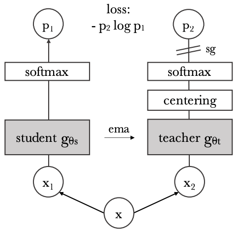

Paper: [Caron et al. (2021), Emerging Properties in Self-Supervised Vision Transformers](https://arxiv.org/abs/2104.14294).
This DINO is the visual self-distillation method, distinct from the later object detector with the same name.

## Problem

How can a model learn useful visual features without class labels or image captions?
DINO trains a student to predict a teacher's output distribution from another crop of the same image.
The challenge is preventing a trivial solution in which every image receives the same output.

## Previous Attempts

Supervised distillation transfers targets from an already trained teacher.
Contrastive self-supervision often distinguishes matching views from negative examples.
DINO builds its teacher from the student's previous states and uses cross-entropy between view predictions without an explicit negative-pair loss. [Sections 2–3](https://arxiv.org/pdf/2104.14294#page=2).

## Proposed Solution

Student and teacher have the same architecture: a visual backbone followed by a projection head.
The head uses an MLP, L2 normalization, and a weight-normalized final linear layer.
In the ViT version it reads the class-token representation; a ResNet does not acquire a ViT class token merely by using the same training method.
Downstream evaluation uses backbone features rather than requiring the training head. [Section 3.1](https://arxiv.org/pdf/2104.14294#page=4).

{width="100%" fig-alt="Student and teacher process different image views, with cross-entropy between their outputs and an EMA teacher update"}

The teacher processes two global crops.
The student processes those global crops plus smaller local crops.
For each teacher crop, the loss compares its output with student outputs from the other views, excluding the identical crop pairing.
This asks a local view to agree with a representation informed by more of the image. [Section 3.1 and Algorithm 1](https://arxiv.org/pdf/2104.14294#page=3).

Let $g_s$ and $g_t$ denote the complete student and teacher, including their projection heads.
Their logits become distributions over output coordinates:

$$
    \begin{aligned}
        p_s(x)&=\operatorname{softmax}(g_s(x)/T_s),\\
        p_t(x)&=\operatorname{softmax}((g_t(x)-c)/T_t).
    \end{aligned}
$$

These coordinates are learned training outputs, not supplied semantic class labels.
For an allowed pair of views $(x,x')$, the student minimizes

$$
    L(x,x')=-\sum_k p_{t,k}(x)\log p_{s,k}(x').
$$

The teacher distribution is treated as a fixed target for backpropagation through this loss.
The teacher weights instead follow an exponential moving average of the student weights:

$$
    \theta_t\leftarrow\lambda\theta_t+(1-\lambda)\theta_s.
$$

## Why Centering and Sharpening Matter

The center $c$ tracks the batch mean of teacher logits through a moving average and is subtracted before the teacher softmax.
A lower teacher temperature sharpens the distribution.
The paper's analysis finds complementary effects: centering discourages domination by one output coordinate, while sharpening counteracts uniformly spread predictions.
Their combination with the moving teacher avoids collapse in the reported training settings. [Section 5.3 and Algorithm 1](https://arxiv.org/pdf/2104.14294#page=8).
This is not a guarantee of exactly balanced semantic classes, and a moving-average teacher alone does not establish that collapse is impossible.

::: {.callout-note collapse="true" icon="false" title="Mechanism: the two updates outside student backpropagation"}
For $B$ teacher views in the center-update batch, write

$$
    \begin{aligned}
        \bar g_t&=\frac1B\sum_{i=1}^B g_t(x_i),\\
        c&\leftarrow mc+(1-m)\bar g_t.
    \end{aligned}
$$

This updates an output statistic, while the teacher EMA updates parameters.
Neither is a gradient step on teacher parameters through the cross-entropy target.
Subtracting the vector $c$ adjusts output coordinates differently; subtracting a single common scalar would leave softmax unchanged.
:::

## Evidence and Limitations

The paper evaluates frozen features with nearest-neighbor and linear classifiers and examines the spatial structure of ViT attention maps.
Its visualizations show object-related structure emerging without segmentation labels. [Sections 4–5](https://arxiv.org/pdf/2104.14294#page=5).
An attention visualization is not by itself a trained segmentation system or a proof that an attention weight explains a prediction causally.
Crop design, temperatures, teacher momentum, and architecture remain consequential parts of the method.

## Connections

[ViT](vit.qmd) supplies the patch-based backbone; DINO specifies a self-supervised objective and teacher update.
[CLIP](../multimodal/clip.qmd) instead uses paired text to align images with language.
The [cross-entropy note](../../study-notes/mathematics/entropy.qmd#cross-entropy) explains why DINO can train against a soft target distribution rather than a one-hot label.
