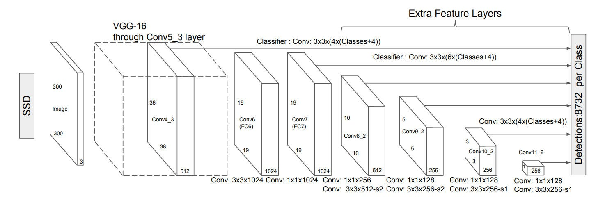

Paper: [Liu et al. (2016), SSD: Single Shot MultiBox Detector](https://arxiv.org/abs/1512.02325).
The preprint first appeared in 2015.

## Problem

Objects occupy different fractions of an image.
SSD predicts detections from several feature maps, giving the network default boxes of different sizes and shapes without requiring a proposal stage followed by a region classifier.

## Previous Attempts

[Faster R-CNN](faster-r-cnn.qmd) uses anchors to generate proposals and then classifies their pooled features.
Original [YOLO](yolo.qmd) predicts from a single output grid.
SSD attaches prediction heads to multiple feature maps and directly outputs semantic class scores and box offsets at each default box. [Sections 1–2](https://arxiv.org/pdf/1512.02325#page=2).

## Proposed Solution

A convolutional backbone and additional feature layers produce maps at different spatial resolutions.
Each location has predefined default boxes with selected scales and aspect ratios.
For every default box, the detector predicts offsets and scores for the object classes plus background.
There is no second region-wise classification stage. [Section 2.1 and Figure 2](https://arxiv.org/pdf/1512.02325#page=3).

{width="100%" fig-alt="SSD backbone and additional convolutional maps each produce class and box predictions before non-maximum suppression"}

For $m$ selected maps, the paper describes a scale schedule

$$
    s_k=s_{\min}+
    \frac{s_{\max}-s_{\min}}{m-1}(k-1).
$$

At scale $s_k$ and aspect ratio $a$, normalized default-box dimensions are

$$
    w=s_k\sqrt a,\qquad h=s_k/\sqrt a.
$$

An additional square box uses scale $s'_k=\sqrt{s_ks_{k+1}}$.
This adds a box between adjacent scales; it does not replace the layer's original square box.
The generic schedule and the special choices for particular layers or SSD variants should be distinguished. [Section 2.2](https://arxiv.org/pdf/1512.02325#page=5).

## Matching and Training

Training first ensures each ground-truth object has a default-box match, using the best-overlap matching procedure.
It then matches further default boxes whose IoU with a target exceeds 0.5.
Several default boxes can therefore learn from one object, unlike [DETR's](detr.qmd) one-to-one assignment of prediction slots. [Section 2.2](https://arxiv.org/pdf/1512.02325#page=4).

If $N$ is the number of matched default boxes, the objective is

$$
    L=\frac{L_{\mathrm{conf}}+\alpha L_{\mathrm{loc}}}{N}.
$$

The paper defines zero loss when $N=0$.
Localization sums Smooth L1 penalties over matched boxes, using center offsets and log-scale size offsets.
Confidence uses multiclass softmax loss, including background.
Hard-negative mining selects the highest-loss unmatched boxes, keeping at most three negatives per positive rather than allowing background to dominate the objective. [Section 2.2, Equations 1–3](https://arxiv.org/pdf/1512.02325#page=4).

::: {.callout-note collapse="true" icon="false" title="Geometry: box centers and offset targets"}
On a square feature map with side length $f_k$, the default-box center at zero-based location $(i,j)$ is

$$
    c_x=(i+\tfrac12)/f_k,\qquad
    c_y=(j+\tfrac12)/f_k.
$$

For default box $d$ and matched target $g$, the target transform is

$$
    \begin{aligned}
        t_x&=(g_x-d_x)/d_w,\\
        t_y&=(g_y-d_y)/d_h,\\
        t_w&=\log(g_w/d_w),\\
        t_h&=\log(g_h/d_h).
    \end{aligned}
$$

Implementations can additionally scale these regression targets, so decoding must invert the same convention used during training.
The base geometry is the same center-and-log-size transformation explained in [R-CNN](r-cnn.qmd#box-regression).
:::

## Evidence and Limitations

The paper evaluates speed and accuracy and ablates feature-map choices, default boxes, and training components. [Section 3](https://arxiv.org/pdf/1512.02325#page=6).
Multiple scales help cover object sizes, but performance still depends on feature resolution, matching, and data augmentation.
The original analysis identifies small-object detection as a remaining weakness.
Inference still filters scores and applies non-maximum suppression; one-shot prediction does not imply that postprocessing disappears.

## Connections

[Fast R-CNN](fast-r-cnn.qmd) explains the Smooth L1 localization penalty.
[YOLO](yolo.qmd) illustrates a different original one-stage parameterization, and [DETR](detr.qmd) replaces dense default-box matching with set prediction.
