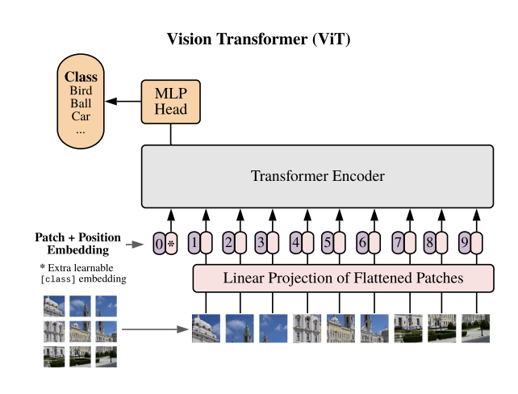

Paper: [Dosovitskiy et al. (2020), An Image is Worth 16x16 Words](https://arxiv.org/abs/2010.11929).

## Problem

Transformers process sequences of vectors, while an image is a spatial array of pixel values.
ViT asks whether an image can be represented as a sequence of patches and processed by a largely standard transformer encoder for classification.

## Previous Attempts

Convolutional networks build in locality and weight sharing across image positions.
Earlier vision systems also combine convolutions and attention.
ViT studies a direct patch-to-transformer architecture and how its weaker image-specific inductive biases interact with the amount of pretraining data. [Sections 1–3](https://arxiv.org/pdf/2010.11929#page=2).

## Proposed Solution

For an image with height $H$, width $W$, and $C$ channels, divide it into nonoverlapping $P\times P$ patches.
Assume $H$ and $W$ are divisible by $P$.
Each flattened patch $x_p^i$ has $P^2C$ coordinates, and a learned linear projection maps it to an embedding with $d$ coordinates:

$$
    \begin{aligned}
        N&=HW/P^2,\\
        e_i&=x_p^iE,\\
        E&\in\mathbb{R}^{(P^2C)\times d}.
    \end{aligned}
$$

A convolution with kernel size and stride both equal to $P$ can implement this shared patch projection, provided its output is rearranged into the patch sequence.
It is an embedding operation, not an assignment of patches to discrete vocabulary IDs.

{width="100%" fig-alt="An image becomes projected patch tokens plus a class token before repeated transformer encoder layers"}

A learned class token is prepended, and learned positional embeddings are added:

$$
    z_0=[x_{\mathrm{cls}};e_1;\ldots;e_N]
    +E_{\mathrm{pos}}.
$$

Every encoder block applies LayerNorm before attention and before its MLP, with a residual connection around each sublayer.
The final class-token representation passes through LayerNorm and a classification head. [Section 3.1, Equations 1–4](https://arxiv.org/pdf/2010.11929#page=3).

::: {.callout-note collapse="true" icon="false" title="Equations: one ViT encoder block"}
For block $\ell$, with multi-head self-attention denoted by $\operatorname{MSA}$,

$$
    \begin{aligned}
        z'_\ell&=z_{\ell-1}
        +\operatorname{MSA}(\operatorname{LN}(z_{\ell-1})),\\
        z_\ell&=z'_\ell
        +\operatorname{MLP}(\operatorname{LN}(z'_\ell)).
    \end{aligned}
$$

The MLP is applied to each sequence position and contains two linear maps with a GELU nonlinearity between them.
Self-attention allows patch and class-token representations to exchange information across the whole sequence.
The shared study notes explain [attention weights](../../study-notes/machine-learning/attention.qmd#weights-and-values) and [LayerNorm](../../study-notes/machine-learning/normalization.qmd#layernorm).
:::

## Evidence and Limitations

The paper's comparisons show that large-scale pretraining is central to the strong transfer results of the original ViT models.
The result does not imply that replacing convolutions with attention automatically improves accuracy in small-data settings. [Section 4.3 and Figure 3](https://arxiv.org/pdf/2010.11929#page=6).
Higher-resolution fine-tuning increases the patch count, so the paper interpolates the pretrained positional embeddings on their two-dimensional grid. [Section 3.2](https://arxiv.org/pdf/2010.11929#page=4).
For standard dense attention, doubling both image dimensions at fixed patch size multiplies the number of patch tokens by four and approximately multiplies the patch-to-patch attention matrix size by sixteen.

## Connections

[DINO](dino.qmd) changes how a ViT representation is trained, using a moving teacher and multiple crops.
[CLIP](../multimodality/clip.qmd) can use a ViT image encoder while learning alignment with text.
[PaliGemma](../multimodality/paligemma.qmd) supplies a sequence of visual features to a language model, rather than using only a class token for classification.
