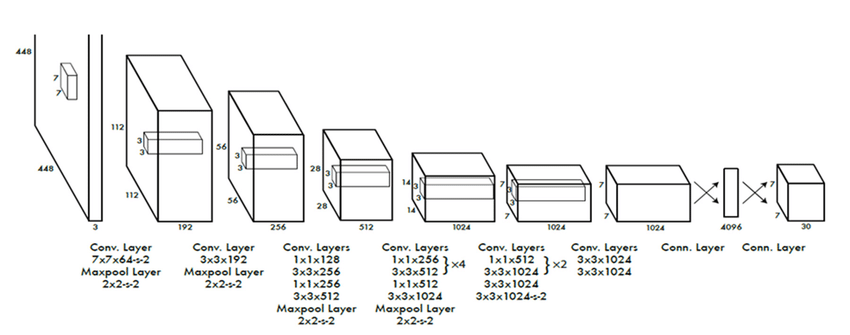

Paper: [Redmon et al. (2016), You Only Look Once: Unified, Real-Time Object Detection](https://arxiv.org/abs/1506.02640).
This note covers the original YOLO, first released as a 2015 preprint, rather than later YOLO versions.

## Problem

A proposal-based detector first selects candidate regions and then classifies and refines them.
YOLO predicts object categories and bounding boxes directly from the whole image in one network evaluation.

## Previous Attempts

[R-CNN](r-cnn.qmd) and its successors organize detection around candidate regions.
YOLO treats the image-to-detections mapping as a single regression problem, with a fixed grid determining which outputs are responsible for which objects. [Sections 1–2](https://arxiv.org/pdf/1506.02640#page=2).

## Proposed Solution

Divide the image into an $S\times S$ grid.
The cell containing an object's center is responsible for that object.
Each cell predicts $B$ boxes with five quantities each, $(x,y,w,h,c)$, plus one shared vector of $C$ conditional class scores:

$$
    \text{output shape}=S\times S\times(5B+C).
$$

The box center is expressed relative to its grid cell, while width and height are normalized by image dimensions.
The class vector belongs to the cell, so the $B$ box predictors do not each have an independent class vector.
The original VOC configuration uses $S=7$, $B=2$, and $C=20$. [Section 2](https://arxiv.org/pdf/1506.02640#page=2).

{width="100%" fig-alt="Original YOLO convolutional network followed by fully connected layers and a seven by seven prediction grid"}

The intended confidence combines object presence and box quality:

$$
    \begin{aligned}
        c&\approx P(\mathrm{object})\,\operatorname{IoU},\\
        s_k&=P(k\mid\mathrm{object})\,c.
    \end{aligned}
$$

Thus, the class-specific detection score includes overlap quality as well as class confidence.
It should not automatically be interpreted as a calibrated probability that class $k$ is present.
Non-maximum suppression is still used to reduce redundant detections. [Sections 2 and 2.3](https://arxiv.org/pdf/1506.02640#page=2).

## Responsibility and Loss

Within the responsible cell, the box predictor with the highest current IoU with the target receives the object's localization supervision.
The original objective combines localization, confidence, and class errors:

$$
    L=\lambda_{\mathrm{coord}}L_{\mathrm{loc}}
      +L_{\mathrm{conf}}+L_{\mathrm{class}}.
$$

All three use squared-error terms in the original paper, including the class term.
The loss is therefore not the later, commonly assumed combination of a box loss and class cross-entropy.
Background confidence errors are downweighted, and localization uses square roots of width and height to change sensitivity to box size. [Section 2.2, Equation 3](https://arxiv.org/pdf/1506.02640#page=4).

::: {.callout-note collapse="true" icon="false" title="Loss details: which prediction receives which target"}
For a responsible predictor with target $(x,y,w,h)$, its localization contribution is

$$
    \begin{aligned}
        \ell_{\mathrm{loc}}&=(\hat x-x)^2+(\hat y-y)^2\\
        &\quad+(\sqrt{\hat w}-\sqrt w)^2\\
        &\quad+(\sqrt{\hat h}-\sqrt h)^2.
    \end{aligned}
$$

The responsible box's confidence target is its IoU with the ground-truth box.
Predictors without an assigned object receive a zero confidence target, with their squared confidence error scaled by $\lambda_{\mathrm{noobj}}$.
Class loss is evaluated for cells containing an object:

$$
    \ell_{\mathrm{class}}=\sum_k(\hat p_k-p_k)^2.
$$

The original recipe uses $\lambda_{\mathrm{coord}}=5$ and $\lambda_{\mathrm{noobj}}=0.5$.
These weights compensate for the different roles and frequencies of the terms; they are not probabilities.
:::

## Evidence and Limitations

The paper measures speed and detection quality against contemporary systems and analyzes error types.
Its analysis identifies localization errors and difficulty with small, grouped objects. [Sections 3–4](https://arxiv.org/pdf/1506.02640#page=5).
The cell ownership rule and shared class vector constrain crowded scenes with several object centers in the same cell.
The title's real-time claim concerns the reported original hardware and model variants, not every later deployment.

## Connections

[SSD](ssd.qmd) predicts from default boxes on multiple feature-map scales.
[Faster R-CNN](faster-r-cnn.qmd) instead uses anchors to propose regions for a second detection stage.
The [loss hub](../../study-notes/machine-learning/loss.qmd#loss-and-risk) helps separate prediction parameterization, target assignment, and the penalty applied after assignment.
