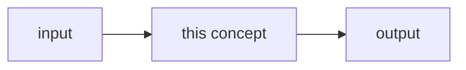

## In one line

## Intuition


```mermaid
flowchart LR
  A[input] --> B[this concept] --> C[output]
```

## How it works

```TEX
```

## Not to be confused with

- similar concept —

## Minimal example

```python
```

## When to use it

-

## Sources
